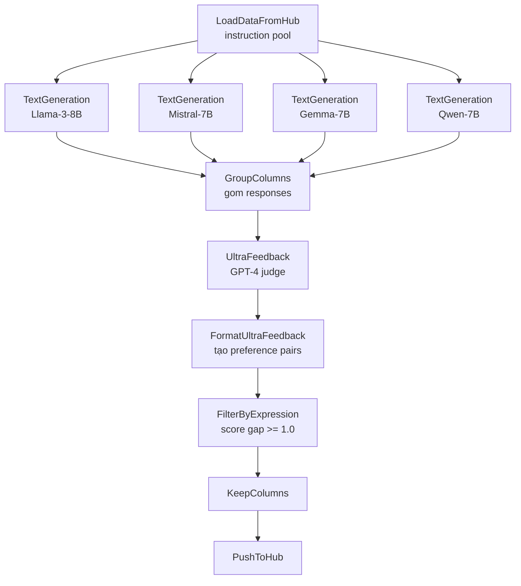

# Case 1: UltraFeedback Pipeline

## Bối cảnh

UltraFeedback dataset (Cui et al., 2023) là backbone của Zephyr-7B-Beta và nhiều mô hình chat chất lượng cao khác. Dataset gốc chứa 64.000 instructions, mỗi instruction có responses từ bốn LLM khác nhau, tất cả được GPT-4 chấm điểm theo bốn chiều. Phần này hướng dẫn tái tạo pipeline đó bằng distilabel.

## Kiến trúc Pipeline



## Code đầy đủ

```python
from distilabel.models import InferenceEndpointsLLM, OpenAILLM
from distilabel.pipeline import Pipeline
from distilabel.steps import (
    LoadDataFromHub,
    GroupColumns,
    FilterByExpression,
    KeepColumns,
)
from distilabel.steps.tasks import TextGeneration, UltraFeedback

llm_llama = InferenceEndpointsLLM(
    model_id="meta-llama/Meta-Llama-3-8B-Instruct",
    generation_kwargs={"max_new_tokens": 1024, "temperature": 0.7},
)
llm_mistral = InferenceEndpointsLLM(
    model_id="mistralai/Mistral-7B-Instruct-v0.3",
    generation_kwargs={"max_new_tokens": 1024, "temperature": 0.7},
)
llm_gemma = InferenceEndpointsLLM(
    model_id="google/gemma-7b-it",
    generation_kwargs={"max_new_tokens": 1024, "temperature": 0.7},
)
llm_qwen = InferenceEndpointsLLM(
    model_id="Qwen/Qwen2-7B-Instruct",
    generation_kwargs={"max_new_tokens": 1024, "temperature": 0.7},
)

judge = OpenAILLM(
    model="gpt-4o",
    generation_kwargs={"temperature": 0.0},
)

with Pipeline(name="ultrafeedback-pipeline") as pipeline:
    load = LoadDataFromHub(
        repo_id="HuggingFaceH4/instruction-dataset",
        split="train",
        batch_size=32,
    )

    gen_llama   = TextGeneration(llm=llm_llama,   name="gen_llama")
    gen_mistral = TextGeneration(llm=llm_mistral, name="gen_mistral")
    gen_gemma   = TextGeneration(llm=llm_gemma,   name="gen_gemma")
    gen_qwen    = TextGeneration(llm=llm_qwen,    name="gen_qwen")

    group = GroupColumns(
        columns=["generation", "model_name"],
        output_columns=["generations", "generation_models"],
    )

    uf_task = UltraFeedback(
        llm=judge,
        aspect="overall-rating",
        input_batch_size=4,
    )

    # Lọc: cần ít nhất một response tốt (>= 4) và một kém (<= 2)
    filter_step = FilterByExpression(
        expression="max(ratings) >= 4 and min(ratings) <= 2",
    )

    keep = KeepColumns(
        columns=[
            "instruction", "generations", "generation_models",
            "ratings", "rationales",
        ],
    )

    load >> [gen_llama, gen_mistral, gen_gemma, gen_qwen] >> group
    group >> uf_task >> filter_step >> keep

if __name__ == "__main__":
    distiset = pipeline.run(use_cache=True)
    distiset.push_to_hub("my-org/ultrafeedback-repro")
```

## Giải thích thiết kế

**Tại sao dùng bốn LLM?** Preference pair chỉ có giá trị khi `chosen` và `rejected` thực sự khác biệt về chất lượng. Dùng một model duy nhất sẽ tạo ra responses có phân phối hẹp, khó tạo cặp có $\Delta s \geq 1.0$. Kết hợp các model thương mại và open-weight đảm bảo diversity về cả phong cách lẫn năng lực.

**FilterByExpression**: Điều kiện `max(ratings) >= 4 and min(ratings) <= 2` đảm bảo (1) có ít nhất một response đủ tốt làm `chosen`, và (2) có ít nhất một response đủ kém làm `rejected`. Cặp có margin nhỏ gây noise cho DPO training, làm loss signal yếu.

**temperature=0.0 cho judge**: Judge cần nhất quán. Tăng temperature của judge làm tăng variance trong ratings và giảm reliability của preference pairs.

## Kết quả mong đợi

Với 5.000 instructions và bốn LLM, pipeline giữ lại khoảng 3.000 đến 4.000 preference pairs sau lọc. Chi phí GPT-4 judge ước tính 8 đến 12 USD cho 5.000 instructions với batch_size=4. Caching (`use_cache=True`) cho phép resume pipeline nếu bị gián đoạn mà không mất tiến độ.
