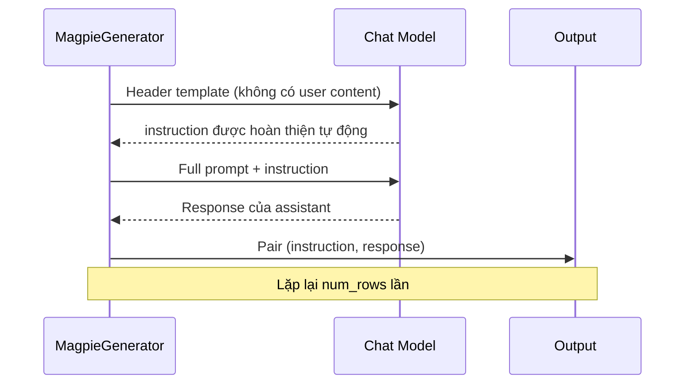

# Case 2: Magpie Instruction Generation

## Bối cảnh

Magpie (Xu et al., 2024) là kỹ thuật sinh instruction dataset mà không cần seed pool hay dữ liệu ban đầu. Kỹ thuật này khai thác một đặc điểm của các instruction-tuned models: khi được cung cấp chỉ phần header của chat template (không có nội dung user), model sẽ auto-regressively hoàn thiện phần user message, tạo ra instructions phản ánh phân phối huấn luyện tự nhiên.

## Cơ chế hoạt động

Với Llama-3-Instruct, chat template chuẩn có dạng:

```
<|begin_of_text|><|start_header_id|>system<|end_header_id|>
{system_prompt}<|eot_id|>
<|start_header_id|>user<|end_header_id|>
{user_message}<|eot_id|>
<|start_header_id|>assistant<|end_header_id|>
```

Magpie chỉ cung cấp đến `<|start_header_id|>user<|end_header_id|>` và để model điền tiếp. Vì model học từ hàng triệu cuộc hội thoại thực, nội dung được sinh ra phản ánh các câu hỏi và yêu cầu thực tế của người dùng.

## Kiến trúc Pipeline



## Code đầy đủ

```python
from distilabel.models import InferenceEndpointsLLM
from distilabel.pipeline import Pipeline
from distilabel.steps.tasks.magpie import MagpieGenerator
from distilabel.steps import FilterByExpression, KeepColumns

llm = InferenceEndpointsLLM(
    model_id="meta-llama/Meta-Llama-3.1-8B-Instruct",
    tokenizer_id="meta-llama/Meta-Llama-3.1-8B-Instruct",
    generation_kwargs={
        "temperature": 1.0,
        "max_new_tokens": 2048,
        "do_sample": True,
    },
)

SYSTEM_PROMPT = (
    "You are a helpful, respectful and honest assistant. "
    "Always answer as helpfully as possible."
)

with Pipeline(name="magpie-generation") as pipeline:
    magpie = MagpieGenerator(
        llm=llm,
        system_prompt=SYSTEM_PROMPT,
        n_turns=1,
        num_rows=5000,
        batch_size=100,
        only_instruction=False,  # sinh cả instruction lẫn response
    )

    # Lọc các instruction quá ngắn hoặc không có nghĩa
    filter_short = FilterByExpression(
        expression="len(instruction.split()) >= 8",
    )

    keep = KeepColumns(
        columns=["instruction", "response", "system_prompt"],
    )

    magpie >> filter_short >> keep

if __name__ == "__main__":
    distiset = pipeline.run()
    distiset.push_to_hub("my-org/magpie-llama3-5k")
```

## Phân tích chất lượng

### Phân phối chủ đề

Dataset được tạo bằng Magpie từ Llama-3-Instruct thường phân phối như sau (ước tính từ paper gốc):

| Chủ đề | Tỷ lệ xấp xỉ |
|---|---|
| Coding và lập trình | 25% |
| Toán và logic | 18% |
| Viết lách và sáng tạo | 20% |
| Phân tích và tóm tắt | 15% |
| Hỏi đáp thông thường | 22% |

### So sánh với Self-Instruct

| Tiêu chí | Self-Instruct | Magpie |
|---|---|---|
| Cần seed data | Có (175+ instructions) | Không |
| Kiểm soát chủ đề | Cao (qua seed) | Thấp |
| Tính tự nhiên | Trung bình | Cao |
| Chi phí mỗi instruction | Cao (context dài) | Thấp (prompt ngắn) |
| Nguy cơ bias | Seed pool bias | Training data bias |

### Multi-turn generation

`n_turns > 1` cho phép sinh hội thoại nhiều lượt, phù hợp cho SFT trên conversation data:

```python
magpie_multi = MagpieGenerator(
    llm=llm,
    n_turns=3,         # hội thoại 3 lượt
    num_rows=1000,
    system_prompt=SYSTEM_PROMPT,
)
```

## Giới hạn và biện pháp khắc phục

Magpie không kiểm soát được phân phối chủ đề. Để hướng dataset vào domain cụ thể (ví dụ: y tế, pháp lý), có thể thay đổi system prompt:

```python
DOMAIN_PROMPT = (
    "You are a medical assistant specializing in clinical documentation. "
    "Users are healthcare professionals asking about clinical procedures."
)
```

System prompt đặc thù sẽ shift phân phối của instructions về domain mong muốn mà vẫn giữ tính tự nhiên.
