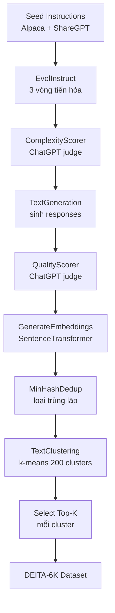

# Case 3: DEITA Dataset Pipeline

## Bối cảnh

DEITA (Data Efficient Instruction Tuning for Alignment, Liu et al., 2023) chứng minh rằng một dataset 6.000 samples được chọn lọc kỹ có thể vượt qua các dataset 50.000+ samples trên nhiều benchmark. Chiến lược lọc gồm ba tầng: complexity scoring, quality scoring, và diversity filtering qua embedding clustering.

## Kiến trúc Pipeline



## Công thức scoring tổng hợp

DEITA kết hợp điểm complexity và quality theo tích:

$$
S_{\text{combined}}(x, y) = S_{\text{complexity}}(x) \times S_{\text{quality}}(x, y)
$$

Với $x$ là instruction và $y$ là response. Thiết kế này đảm bảo cả hai chiều đều phải đủ tốt: một instruction phức tạp có response kém vẫn bị loại, và ngược lại.

## Code đầy đủ

```python
from distilabel.models import OpenAILLM
from distilabel.embeddings import SentenceTransformerEmbeddings
from distilabel.pipeline import Pipeline
from distilabel.steps import (
    LoadDataFromHub,
    FilterByExpression,
    KeepColumns,
)
from distilabel.steps.tasks import (
    EvolInstruct,
    TextGeneration,
    ComplexityScorer,
    QualityScorer,
    GenerateEmbeddings,
)
from distilabel.steps.globals import MinHashDedup, TextClustering

scorer_llm = OpenAILLM(
    model="gpt-3.5-turbo",
    generation_kwargs={"temperature": 0.0},
)

with Pipeline(name="deita-pipeline") as pipeline:
    load = LoadDataFromHub(
        repo_id="HuggingFaceH4/instruction-dataset",
        split="train",
        batch_size=64,
    )

    # Tầng 1: Tăng complexity qua EvolInstruct
    evol = EvolInstruct(
        llm=OpenAILLM(
            model="gpt-3.5-turbo",
            generation_kwargs={"temperature": 1.0},
        ),
        num_evolutions=3,
        store_evolutions=False,
        generate_answers=False,
    )

    # Tầng 2a: Chấm điểm complexity
    complexity = ComplexityScorer(
        llm=scorer_llm,
        input_batch_size=16,
    )

    # Tầng 2b: Sinh response cho instruction đã evolved
    gen = TextGeneration(
        llm=OpenAILLM(
            model="gpt-3.5-turbo",
            generation_kwargs={"temperature": 0.7, "max_new_tokens": 1024},
        ),
    )

    # Tầng 2c: Chấm điểm quality
    quality = QualityScorer(
        llm=scorer_llm,
        input_batch_size=16,
    )

    # Lọc sơ bộ: complexity >= 2 và quality >= 2
    prefilter = FilterByExpression(
        expression="complexity_score >= 2 and quality_score >= 2",
    )

    # Tầng 3: Embedding và diversity
    embed = GenerateEmbeddings(
        embeddings=SentenceTransformerEmbeddings(
            model="sentence-transformers/all-MiniLM-L6-v2",
        ),
        input_batch_size=128,
    )

    # GlobalStep: loại trùng lặp trước clustering
    dedup = MinHashDedup(
        tokenizer="whitespace",
        threshold=0.85,
        storage="dict",
    )

    # GlobalStep: clustering toàn bộ dataset
    cluster = TextClustering(
        embedding_column="embedding",
        n_clusters=200,
    )

    # Lọc: lấy top 30 mỗi cluster => ~6000 samples
    final_filter = FilterByExpression(
        expression="cluster_rank <= 30",
    )

    keep = KeepColumns(
        columns=["instruction", "generation", "complexity_score", "quality_score"],
    )

    load >> evol >> complexity >> gen >> quality >> prefilter
    prefilter >> embed >> dedup >> cluster >> final_filter >> keep

if __name__ == "__main__":
    distiset = pipeline.run(use_cache=True)
    distiset.push_to_hub("my-org/deita-6k-repro")
```

## Vai trò của GlobalStep

`MinHashDedup` và `TextClustering` là `GlobalStep`: chúng cần toàn bộ dataset trong bộ nhớ trước khi xử lý. Điều này có hai hệ quả:

1. **Không thể stream**: pipeline phải hoàn thành tất cả các bước trước GlobalStep trước khi tiếp tục.
2. **Giới hạn RAM**: với 50.000 embeddings chiều 384, cần khoảng 70 MB RAM, chấp nhận được.

## Kết quả theo tầng lọc

| Sau bước | Số samples |
|---|---|
| Seed instructions | 52.000 |
| Sau EvolInstruct (3 vòng) | ~150.000 |
| Sau pre-filter (complexity + quality) | ~50.000 |
| Sau MinHashDedup | ~42.000 |
| Sau TextClustering (top-30 per cluster) | ~6.000 |

Dataset cuối cùng ~6.000 samples đạt MT-Bench score 5.99 so với 5.17 của Alpaca-52K, xác nhận nguyên tắc: chọn lọc kỹ lưỡng hiệu quả hơn thu thập ồ ạt.
