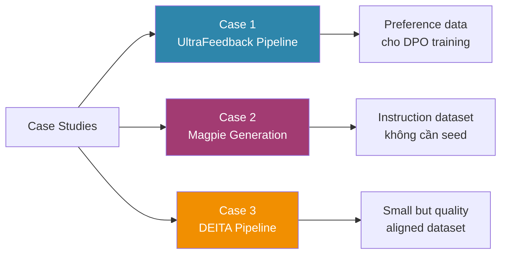

# Lộ trình Case Studies

Phần **Case Studies** chuyển hóa lý thuyết thành các pipeline distilabel hoàn chỉnh, có thể chạy được. Mỗi case study tái hiện một phương pháp tạo dữ liệu nổi tiếng từ nghiên cứu học thuật, đồng thời phân tích các quyết định thiết kế quan trọng.

## Tổng quan ba case studies

## Case 1: UltraFeedback Pipeline

Tái tạo pipeline tạo **UltraFeedback dataset** được dùng để fine-tune Zephyr-7B và nhiều mô hình Mistral-based. Pipeline bao gồm: thu thập instruction từ Hugging Face Hub, sinh response song song từ bốn LLM khác nhau, gom cột với `GroupColumns`, chấm điểm đa chiều qua GPT-4 judge, và lọc theo ngưỡng điểm.

Kết quả: tập preference pairs có cấu trúc `(instruction, chosen_response, rejected_response)` sẵn sàng cho DPO training.

**Lý thuyết liên quan**: Lý thuyết 1 (UltraFeedback Scoring), Lý thuyết 3 (Preference Dataset Creation)

## Case 2: Magpie Instruction Generation

Sử dụng `MagpieGenerator` trong distilabel để tạo instruction dataset tự nhiên từ một chat model mà không cần seed pool. Phân tích phân phối chủ đề, độ phức tạp và chất lượng ngôn ngữ của dataset được tạo ra. So sánh với dataset được tạo bằng Self-Instruct trên cùng model.

Kết quả: instruction dataset với phân phối phản ánh câu hỏi người dùng thực tế, phù hợp cho SFT hoặc làm đầu vào cho pipeline đánh giá tiếp theo.

**Lý thuyết liên quan**: Lý thuyết 4 (Magpie và Self-Instruct)

## Case 3: DEITA Dataset Pipeline

DEITA (Data Efficient Instruction Tuning for Alignment) là phương pháp tạo dataset nhỏ nhưng hiệu quả cao bằng cách kết hợp ba tầng lọc: complexity scoring (EvolInstruct), quality scoring (ChatGPT judge), và diversity filtering (k-means clustering trên embedding space). Pipeline này phức tạp nhất trong ba case, đòi hỏi hiểu rõ cả EvolInstruct lẫn embedding-based diversity.

Kết quả: dataset khoảng 6.000 samples vượt qua các dataset 50.000+ samples trên nhiều benchmark.

**Lý thuyết liên quan**: Lý thuyết 2 (EvolInstruct), Lý thuyết 3 (Preference Dataset)

## Bảng so sánh nhanh

| Case Study | Kỹ thuật chính | Quy mô output | Mục tiêu training |
|---|---|---|---|
| UltraFeedback | Multi-LLM + LLM-judge | 60K+ pairs | DPO / RLHF |
| Magpie | Template-based generation | Tùy chỉnh | SFT |
| DEITA | EvolInstruct + clustering | ~6K samples | SFT alignment |

## Cách theo dõi case studies

Mỗi case study được viết theo cấu trúc thống nhất: (1) bối cảnh bài toán, (2) kiến trúc pipeline với Mermaid diagram, (3) code đầy đủ với distilabel, (4) phân tích kết quả, (5) biến thể và mở rộng. Học viên nên chạy code trên một subset nhỏ (100 đến 500 samples) trước khi scale lên toàn bộ dataset.
