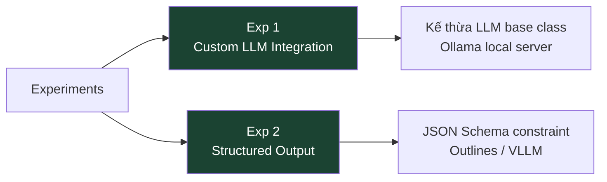

# Lộ trình Experiments

Phần **Experiments** đi vào các kỹ thuật mở rộng và tùy chỉnh distilabel vượt ra ngoài các task có sẵn. Hai experiments tập trung vào câu hỏi thực tế nhất mà kỹ sư ML gặp phải khi triển khai pipeline production: tích hợp LLM tùy chỉnh và tối ưu chi phí với structured output.

## Bản đồ experiments

## Experiment 1: Custom LLM Integration

Distilabel cung cấp sẵn các LLM adapter cho OpenAI, Anthropic, HuggingFace Inference Endpoints và nhiều provider khác. Tuy nhiên, trong môi trường enterprise, thường cần tích hợp với:

- **Ollama**: chạy model cục bộ trên máy tính hoặc server nội bộ
- **Azure OpenAI**: endpoint riêng của tổ chức với auth khác
- **Provider nội bộ**: REST API tự xây dựng

Experiment này hướng dẫn viết custom LLM class bằng cách kế thừa từ `LLM` base class, override hai thành phần bắt buộc là `model_name` property và `generate()` method, sau đó tích hợp vào pipeline distilabel như bất kỳ LLM nào khác.

**Kỹ thuật trọng tâm**:
- Interface `LLM` abstract class và contract của nó
- Xử lý async với `asyncio` trong `agenerate()`
- Error handling và retry logic
- Format chuẩn hóa output theo `GeneratedTextOutput`

## Hai experiments theo trình tự

| Thứ tự | Experiment | Yêu cầu trước | Thời gian ước tính |
|---|---|---|---|
| 1 | Custom LLM Integration | Hiểu kiến trúc distilabel | 60 phút |
| 2 | Structured Output | Hoàn thành Exp 1 | 45 phút |

## Mục tiêu học tập

Sau khi hoàn thành cả hai experiments, học viên có khả năng:

1. Tích hợp bất kỳ LLM provider nào vào distilabel pipeline chỉ bằng cách implement một interface đơn giản.
2. Đảm bảo output của LLM tuân thủ JSON schema cụ thể, loại bỏ hoàn toàn bước post-processing phức tạp.
3. Kết hợp hai kỹ thuật để xây dựng pipeline với custom local model sinh structured output, phù hợp cho môi trường không có kết nối internet.

## Liên kết với kiến trúc distilabel

Cả hai experiments đều yêu cầu hiểu rõ lớp `Step` và `LLM` trong kiến trúc distilabel. Nếu chưa quen, nên xem lại bài **Kiến trúc tổng quan** và **Step Hierarchy** trước khi bắt đầu.
