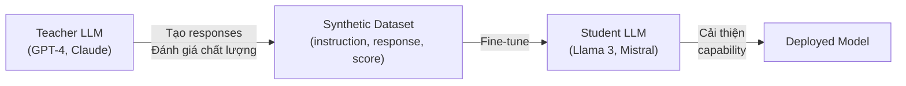

# Bài 0: Tại sao cần Synthetic Data?

## 1. Nút cổ chai dữ liệu trong tinh chỉnh LLM

Huấn luyện mô hình ngôn ngữ lớn (LLM) từ đầu đòi hỏi hàng nghìn tỉ token và ngân sách tính toán khổng lồ. Tuy nhiên, giai đoạn **fine-tuning** (tinh chỉnh hướng dẫn, alignment) lại đặt ra một thách thức khác về bản chất: chất lượng và khối lượng dữ liệu được gán nhãn thủ công.

Chi phí annotation thủ công dao động từ **$10 đến $50 trên mỗi mẫu** khi cần chuyên gia có trình độ (lập trình, y khoa, pháp lý). Với một tập dữ liệu SFT (Supervised Fine-Tuning) cỡ 100.000 mẫu, chi phí ước tính:

$$C_{\text{human}} = N \times c_{\text{per\_sample}} = 100{,}000 \times \$30 = \$3{,}000{,}000$$

Đây là con số không khả thi với phần lớn tổ chức nghiên cứu. Ngoài chi phí, annotation thủ công còn bị ràng buộc bởi tốc độ: một annotator có thể xử lý khoảng 20 đến 50 mẫu mỗi giờ, tạo ra nút cổ chai thời gian nghiêm trọng khi cần mở rộng quy mô nhanh chóng.

## 2. Vòng phản hồi AI (AI Feedback Loop)

Sự xuất hiện của các mô hình frontier như GPT-4, Claude, Gemini Ultra mở ra hướng tiếp cận mới: dùng LLM mạnh hơn để **tạo và đánh giá** dữ liệu cho LLM nhỏ hơn. Cơ chế này được gọi là **AI Feedback Loop** hay **LLM Distillation**.

Nguyên lý cốt lõi: nếu một mô hình teacher có khả năng đánh giá xem câu trả lời A có tốt hơn câu trả lời B không, thì ta có thể thu thập tín hiệu preference đó ở quy mô lớn mà không cần con người. Đây là nền tảng của Constitutional AI (Anthropic) và RLAIF (RL from AI Feedback).

## 3. Phân loại Dataset cần tạo

Tùy theo mục tiêu huấn luyện, các loại dataset synthetic khác nhau phục vụ các giai đoạn alignment khác nhau:

| Loại Dataset | Cấu trúc mẫu | Mục đích |
|---|---|---|
| **SFT (Instruction Tuning)** | `(instruction, response)` | Dạy mô hình tuân theo hướng dẫn |
| **Preference / DPO** | `(prompt, chosen, rejected)` | Direct Preference Optimization |
| **RLHF Reward Modeling** | `(prompt, response, score)` | Huấn luyện reward model |
| **Critique & Revision** | `(response, critique, revision)` | Cải thiện khả năng tự sửa lỗi |

Với **DPO** (Direct Preference Optimization), ta tối ưu hàm mục tiêu:

$$\mathcal{L}_{\text{DPO}}(\pi_\theta) = -\mathbb{E}_{(x, y_w, y_l) \sim \mathcal{D}} \left[ \log \sigma \left( \beta \log \frac{\pi_\theta(y_w | x)}{\pi_{\text{ref}}(y_w | x)} - \beta \log \frac{\pi_\theta(y_l | x)}{\pi_{\text{ref}}(y_l | x)} \right) \right]$$

Trong đó $y_w$ là phản hồi được chọn (chosen) và $y_l$ là phản hồi bị từ chối (rejected). Để tạo cặp $(y_w, y_l)$ này ở quy mô lớn, ta cần sinh nhiều responses rồi dùng LLM mạnh để xếp hạng chúng tự động.

## 4. Vị trí của distilabel trong hệ sinh thái

**distilabel** (do Argilla và HuggingFace phát triển) là framework Python chuyên biệt cho việc tạo synthetic dataset có kiểm soát chất lượng. Nó giải quyết các vấn đề kỹ thuật thực tiễn mà các script ad-hoc thường bỏ qua:

- **Reproducibility**: pipeline được serialize thành YAML/JSON, đảm bảo kết quả tái lập hoàn toàn.
- **Caching**: mỗi batch được cache trên disk; nếu pipeline bị ngắt giữa chừng, tiến trình có thể tiếp tục từ checkpoint.
- **Parallel execution**: bước xử lý LLM chạy song song qua multiprocessing, tối đa throughput trên nhiều CPU hoặc nhiều API endpoint.
- **Distiset integration**: kết quả tự động đóng gói thành HuggingFace Dataset, sẵn sàng push lên Hub hoặc dùng trực tiếp với thư viện `transformers`.

## 5. So sánh chi phí: Synthetic vs. Human Annotation

Giả sử cần tạo 100.000 mẫu SFT sử dụng một LLM inference endpoint (ví dụ Llama 3.1 70B trên HuggingFace Inference Endpoints, tính ở mức giá $0.002 mỗi lần gọi):

$$C_{\text{synthetic}} = N \times c_{\text{per\_call}} = 100{,}000 \times \$0.002 = \$200$$

So với annotation thủ công ở mức thấp nhất ($10 mỗi mẫu):

$$C_{\text{human\_min}} = 100{,}000 \times \$10 = \$1{,}000{,}000$$

Tỉ lệ tiết kiệm chi phí là:

$$R = \frac{C_{\text{human\_min}}}{C_{\text{synthetic}}} = \frac{\$1{,}000{,}000}{\$200} = 5{,}000\times$$

Tuy nhiên, con số này chỉ có ý nghĩa khi chất lượng synthetic data đủ cao cho mục tiêu cụ thể. Chi phí thực tế phụ thuộc vào model được dùng (GPT-4 đắt hơn Llama 70B nhiều lần), độ phức tạp của prompt, và tỉ lệ mẫu cần lọc bỏ sau quality check.

## 6. Khi nào dùng Synthetic Data và khi nào dùng Human Annotation

Lựa chọn giữa hai hướng tiếp cận phụ thuộc vào bản chất của task và yêu cầu chất lượng:

**Synthetic data phù hợp khi:**
- Task có thể được đánh giá tự động (code execution, math verification, factual QA với ground truth rõ ràng).
- Cần khối lượng lớn nhưng không yêu cầu độ sâu chuyên môn cực cao.
- Đang ở giai đoạn prototyping nhanh trước khi đầu tư vào human annotation chuyên sâu.
- Domain mà các LLM frontier đã có năng lực vượt trội (creative writing, code generation, summarization).

**Human annotation không thể thay thế khi:**
- Task đòi hỏi phán xét đạo đức, văn hóa, hoặc ngữ cảnh xã hội tinh tế.
- Domain cực kỳ chuyên biệt mà LLM frontier vẫn chưa đáng tin cậy (phán quyết pháp lý phức tạp, chẩn đoán y khoa hiếm gặp).
- Cần dữ liệu ground truth tuyệt đối (không phải AI-judged preference).

Trong thực tế, chiến lược tối ưu thường là **hybrid**: dùng synthetic data để tạo ra số lượng lớn ban đầu, sau đó dùng human annotation để lọc và kiểm tra chất lượng trên tập nhỏ đại diện. Tỉ lệ phổ biến trong các dự án thực tế là khoảng 80% synthetic và 20% human-verified.

## Tóm tắt

Synthetic data không phải là giải pháp hoàn hảo cho mọi bài toán, nhưng là công cụ thiết yếu trong quy trình alignment hiện đại, cho phép tiết kiệm chi phí hàng nghìn lần so với annotation thủ công. distilabel cung cấp cơ sở hạ tầng để tạo synthetic dataset một cách có hệ thống, có thể tái lập, và có khả năng mở rộng. Các bài tiếp theo sẽ đi sâu vào kiến trúc kỹ thuật của framework này, bắt đầu từ tổng quan module level và cơ chế Pipeline.
