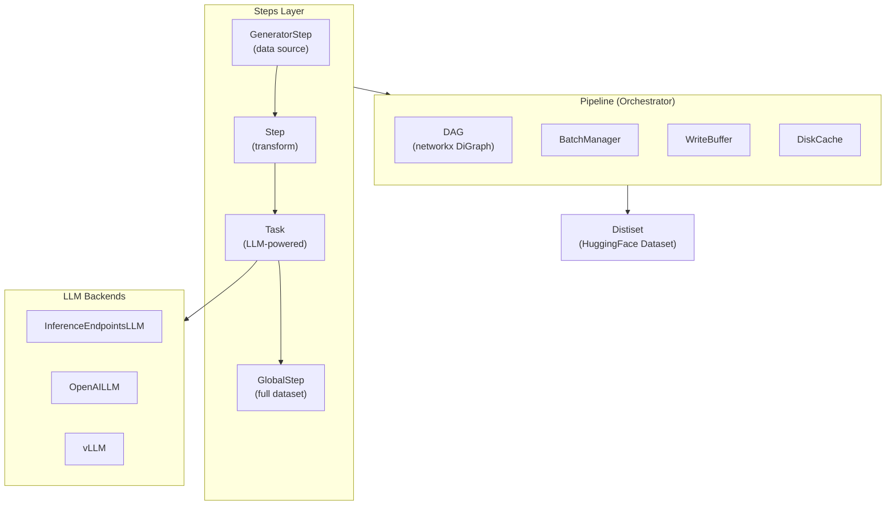
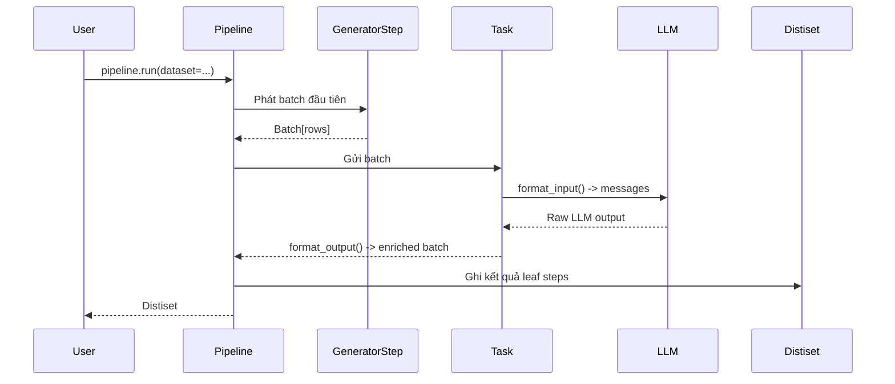

# Bài 1: Tổng quan Kiến trúc distilabel

## 1. Cấu trúc Module

Codebase distilabel được tổ chức theo nguyên tắc **separation of concerns** rõ ràng. Mỗi tầng module chịu trách nhiệm một phạm vi cụ thể và không phụ thuộc vào tầng khác theo hướng từ trên xuống:

```
distilabel/
├── pipeline/          # Orchestration: BasePipeline, DAG, batch management
├── steps/             # Processing units: GeneratorStep, Step, GlobalStep, Task
├── models/            # LLM backends: InferenceEndpointsLLM, OpenAILLM, vLLM, ...
├── distiset.py        # Output container: Distiset (dict subclass)
└── utils/             # Serialization, logging, typing helpers
```

Sự phân tầng này có ý nghĩa thiết kế quan trọng: module `pipeline` không phụ thuộc trực tiếp vào module `models`; nó chỉ giao tiếp qua interface `LLM` trừu tượng. Điều này cho phép thay thế backend (swap từ OpenAI sang vLLM) mà không thay đổi bất kỳ logic pipeline nào.

## 2. Ba Thành phần Chính

### 2.1 Pipeline (Orchestrator)

`Pipeline` là lớp điều phối trung tâm. Nó quản lý vòng đời toàn bộ quá trình: nạp dữ liệu theo batch, định tuyến batch qua các Step theo thứ tự DAG, quản lý cache trên disk, xử lý lỗi và thu thập kết quả cuối cùng vào Distiset.

### 2.2 Steps và Tasks (Workers)

Có ba loại Step cơ bản tạo thành hệ thống phân cấp theo chức năng:

- **GeneratorStep**: nguồn dữ liệu đầu vào; không nhận input từ step nào trước, chỉ phát ra output. Ví dụ: `LoadDataFromHub`, `GenerateEmbryonicSeed`.
- **Step**: biến đổi dữ liệu; nhận batch, trả về batch đã được thêm hoặc thay đổi cột. Ví dụ: `KeepColumns`, `GroupColumns`.
- **GlobalStep**: nhận **toàn bộ** dataset trước khi xử lý; hữu ích cho deduplication, global shuffle hoặc bất kỳ thao tác nào cần nhìn toàn cục.

**Task** là subclass đặc biệt của `Step` tích hợp một `LLM`. Mỗi Task bắt buộc định nghĩa hai phương thức:
- `format_input(input: dict) -> ChatType`: biến đổi một row dữ liệu thành danh sách messages theo OpenAI chat format.
- `format_output(output: str, input: dict) -> dict`: parse raw LLM output thành structured fields được thêm vào row.

### 2.3 LLMs (AI Backends)

Lớp `LLM` trừu tượng hóa giao tiếp với các inference backend khác nhau. Tất cả LLM đều implement phương thức `generate(inputs, **kwargs) -> GenerateOutput`. Backend được hỗ trợ bao gồm: HuggingFace Inference Endpoints, OpenAI-compatible APIs, vLLM, LiteLLM, và Ollama.

## 3. Kiến trúc Tổng quan



## 4. Distiset: Output Container

`Distiset` là subclass của Python `dict`. Sau khi `pipeline.run()` hoàn thành, kết quả được đóng gói với cấu trúc:

```python
{
    "<leaf_step_name>": DatasetDict({
        "train": Dataset({features: [...], num_rows: N})
    })
}
```

Key là tên của **leaf step** (bước cuối trong DAG, không có downstream nào). Điều này quan trọng: nếu pipeline có nhiều nhánh kết thúc tại các step khác nhau, Distiset sẽ có nhiều key tương ứng, cho phép truy xuất kết quả từng nhánh một cách độc lập.

Sau khi có Distiset, upload lên HuggingFace Hub chỉ cần một lệnh duy nhất:

```python
distiset.push_to_hub("my-org/my-dataset")
```

## 5. Luồng Dữ liệu Tổng quát



## 6. RuntimeParameter và RuntimeParametersMixin

Một vấn đề thực tiễn quan trọng: làm thế nào để override tham số của pipeline (ví dụ temperature của LLM, batch size) khi chạy lại mà không cần rebuild toàn bộ object graph từ đầu?

distilabel giải quyết bằng `RuntimeParametersMixin`. Mọi `Step` và `LLM` đều kế thừa mixin này. Các tham số được khai báo với type annotation `RuntimeParameter[T]` có thể override lúc runtime:

```python
class MyStep(Step):
    batch_size: RuntimeParameter[int] = Field(
        default=50,
        description="Number of rows per batch"
    )
```

Khi gọi `pipeline.run()`, ta truyền dictionary `parameters` để override giá trị:

```python
distiset = pipeline.run(
    parameters={
        "my_step": {"batch_size": 100},
        "text_generation_0": {
            "llm": {"generation_kwargs": {"temperature": 0.9}}
        }
    }
)
```

Cơ chế này cực kỳ hữu ích trong các thí nghiệm hyperparameter sweep: ta chỉ cần thay đổi dictionary `parameters` mà không viết lại code pipeline.

## 7. Serialization: Chia sẻ và Tái sử dụng Pipeline

Pipeline có thể được serialize thành YAML hoặc JSON:

```python
pipeline.save("my_pipeline.yaml", format="yaml")
loaded_pipeline = BasePipeline.load("my_pipeline.yaml")
```

Format YAML lưu trữ toàn bộ cấu trúc DAG, loại Step, tham số LLM và các RuntimeParameter default. Đây là cơ chế cho phép **reproducibility** hoàn chỉnh: một nhà nghiên cứu có thể chia sẻ file YAML và người khác tái tạo chính xác cùng quá trình tạo dữ liệu, trên bất kỳ máy nào có cùng phiên bản distilabel.

## 8. Ví dụ Code Tổng hợp

```python
from distilabel.models import InferenceEndpointsLLM
from distilabel.pipeline import Pipeline
from distilabel.steps.tasks import TextGeneration

with Pipeline("my-pipeline") as pipeline:
    TextGeneration(
        llm=InferenceEndpointsLLM(
            model_id="meta-llama/Meta-Llama-3.1-8B-Instruct",
            generation_kwargs={"temperature": 0.7, "max_new_tokens": 512},
        ),
    )

distiset = pipeline.run(dataset=my_dataset)
distiset.push_to_hub("my-org/my-dataset")
```

Lưu ý cú pháp `with Pipeline(...) as pipeline:`. Đây là **context manager pattern** cốt lõi của distilabel. Bên trong block `with`, mọi Step được khởi tạo sẽ tự động đăng ký vào pipeline thông qua cơ chế `_GlobalPipelineManager` (sẽ được phân tích chi tiết trong Bài 2). Kết quả: người dùng không cần gọi `pipeline.add_step(step)` một cách tường minh.

## Tóm tắt

Ba tầng Pipeline, Steps/Tasks, LLMs tạo thành kiến trúc phân tầng rõ ràng với ranh giới trách nhiệm minh bạch. Distiset là output container tích hợp trực tiếp với HuggingFace ecosystem. `RuntimeParameter` cho phép tái sử dụng pipeline linh hoạt mà không cần rebuild. Bài tiếp theo sẽ đi sâu vào cơ chế DAG, `_GlobalPipelineManager`, và toán tử `>>` dùng để kết nối các Step.
