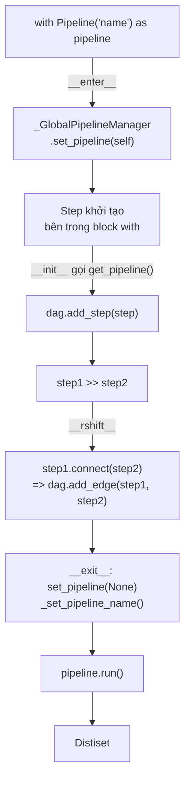

# Bài 2: Pipeline & DAG Architecture

## 1. Tại sao cần DAG?

Một pipeline synthetic data không đơn giản là chuỗi tuần tự các bước. Trên thực tế, nhiều kịch bản đòi hỏi cấu trúc phức tạp hơn: tạo ra hai phiên bản phản hồi song song từ hai LLM khác nhau rồi so sánh; hoặc định tuyến một phần batch đến step kiểm tra chính tả trong khi phần khác đến step kiểm tra logic. Một mảng bước tuyến tính không thể biểu diễn những kịch bản này.

Giải pháp là biểu diễn pipeline như một **Directed Acyclic Graph** (DAG): các node là Step, các cạnh có hướng thể hiện luồng dữ liệu. Tính "acyclic" (không có chu trình) đảm bảo pipeline luôn kết thúc và dữ liệu chảy theo một chiều xác định. Đây là lý do tại sao distilabel sử dụng `networkx.DiGraph` làm nền tảng lưu trữ cấu trúc pipeline.

## 2. Lớp `BasePipeline` và `DAG`

`BasePipeline` là lớp trừu tượng định nghĩa interface chung. Các thuộc tính cốt lõi:

- `name`: định danh duy nhất của pipeline, dùng làm tên thư mục cache.
- `dag`: instance của lớp `DAG`, lưu trữ toàn bộ cấu trúc đồ thị.
- `_batch_manager`: instance của `_BatchManager`, điều phối việc gửi và nhận batch giữa các step.
- `_write_buffer`: buffer ghi kết quả ra disk từng phần, tránh giữ toàn bộ dataset trong RAM.
- `_cache_dir`: đường dẫn thư mục cache, mặc định là `~/.cache/distilabel/pipelines/<name>`.

Lớp `DAG` bao bọc (wraps) một `networkx.DiGraph` và cung cấp các phương thức cấp cao hơn:

```python
class DAG:
    def add_step(self, step: "_Step") -> None: ...
    def add_edge(self, from_step: str, to_step: str) -> None: ...
    def get_step(self, name: str) -> "_Step": ...
    def step_input_info_from_pipeline(self, name: str) -> ...: ...
```

`step_input_info_from_pipeline` là phương thức quan trọng: nó duyệt ngược đồ thị từ một step để suy ra schema input (tập hợp các cột) mà step đó sẽ nhận được từ các predecessor. Phương thức này được dùng trong **eager validation** trước khi pipeline chạy.

## 3. `_GlobalPipelineManager`: Cơ chế Đăng ký Ngầm định

Vấn đề thiết kế: khi người dùng viết `TextGeneration(llm=...)` bên trong block `with Pipeline(...):`, làm thế nào step đó tự động được thêm vào pipeline mà không cần gọi tường minh `pipeline.add_step(...)`?

Câu trả lời là `_GlobalPipelineManager`, một class với biến class static `_context_global_pipeline`:

```python
class _GlobalPipelineManager:
    _context_global_pipeline: Optional["BasePipeline"] = None

    @classmethod
    def set_pipeline(cls, pipeline: Optional["BasePipeline"] = None) -> None:
        cls._context_global_pipeline = pipeline

    @classmethod
    def get_pipeline(cls) -> Optional["BasePipeline"]:
        return cls._context_global_pipeline
```

Khi `BasePipeline.__enter__` được gọi (lúc vào block `with`), nó gọi `_GlobalPipelineManager.set_pipeline(self)`, đăng ký pipeline hiện tại vào biến static toàn cục. Khi một `_Step` được khởi tạo, `__init__` của nó gọi `_GlobalPipelineManager.get_pipeline()` và nếu không phải `None`, tự động gọi `dag.add_step(self)`.

Khi thoát khỏi block `with`, `BasePipeline.__exit__` gọi `_GlobalPipelineManager.set_pipeline(None)` để reset, và gọi thêm `_set_pipeline_name()` để đặt tên cho toàn bộ các step chưa có tên tường minh (dùng quy tắc `<class_name>_<index>`).

## 4. Kiến trúc DAG và Context Manager



## 5. Toán tử `>>` và `routing_batch_function`

Toán tử `>>` là syntactic sugar cho `step1.connect(step2)`. Bên trong `_Step.__rshift__`:

```python
def __rshift__(self, other: "_Step") -> "_Step":
    self.connect(other)
    return other

def connect(self, step: "_Step") -> None:
    self.pipeline.dag.add_edge(self.name, step.name)
```

**Quan trọng**: toán tử `>>` CHỈ đăng ký cạnh trong DAG tại thời điểm khai báo, hoàn toàn KHÔNG thực thi bất kỳ xử lý nào. Toàn bộ quá trình thực thi chỉ xảy ra khi gọi `pipeline.run()`, lúc đó `BatchManager` mới bắt đầu điều phối dữ liệu qua các cạnh của đồ thị.

**`routing_batch_function`** là decorator cho phép tạo hàm điều hướng batch đến tập con (subset) các downstream step, thay vì gửi cho tất cả. Hàm nhận vào danh sách tên các step downstream và trả về tập con được chọn cho batch hiện tại:

```python
from distilabel.pipeline import routing_batch_function
import random

@routing_batch_function
def sample_two_steps(steps: list[str]) -> list[str]:
    return random.sample(steps, 2)
```

Khi `routing_batch_function` được dùng trong toán tử `>>`, distilabel tạo ra một node đặc biệt trong DAG đại diện cho hàm routing này, kết nối các cạnh có điều kiện thay vì cạnh cố định.

## 6. Ví dụ Pipeline Phức tạp với Routing

```python
from distilabel.pipeline import Pipeline, routing_batch_function
from distilabel.steps import LoadDataFromHub, GroupColumns
from distilabel.steps.tasks import TextGeneration
from distilabel.models import InferenceEndpointsLLM
import random

llms = [
    InferenceEndpointsLLM(model_id="meta-llama/Meta-Llama-3.1-8B-Instruct"),
    InferenceEndpointsLLM(model_id="mistralai/Mistral-7B-Instruct-v0.3"),
    InferenceEndpointsLLM(model_id="Qwen/Qwen2.5-7B-Instruct"),
]

@routing_batch_function
def sample_two_steps(steps: list[str]) -> list[str]:
    return random.sample(steps, 2)

with Pipeline("pipeline-with-routing") as pipeline:
    load_data = LoadDataFromHub(repo_id="my-org/prompts")
    tasks = [TextGeneration(llm=llm) for llm in llms]
    combine = GroupColumns(columns=["generation"], output_columns=["generations"])

    load_data >> sample_two_steps >> tasks >> combine
```

Trong kịch bản trên, mỗi batch từ `load_data` sẽ được gửi đến 2 trong số 3 `TextGeneration` task được chọn ngẫu nhiên. Kết quả là mỗi prompt sẽ có responses từ 2 mô hình khác nhau, phù hợp để tạo preference dataset theo kiểu Arena-style.

## 7. Phân tích Toán học về DAG

Với $n$ step và tập cạnh $E$, pipeline hợp lệ phải thỏa mãn:
- **Acyclicity**: đồ thị $G = (V, E)$ không chứa chu trình có hướng. Kiểm tra bằng topological sort (độ phức tạp $O(|V| + |E|)$).
- **Schema consistency**: với mọi cạnh $(u, v) \in E$: $\text{outputs}(u) \supseteq \text{inputs}(v)$.
- **Single source**: có đúng một (hoặc nhiều) GeneratorStep không có predecessor; mọi Step không phải GeneratorStep phải có ít nhất một predecessor.

Thứ tự thực thi được xác định bởi topological order của DAG:

$$\text{order} = \text{topological\_sort}(G)$$

Trong thực thi song song, `BatchManager` có thể dispatch tới tất cả các step trong cùng một "layer" (tập các node không có dependency lẫn nhau) cùng lúc, khai thác parallelism tự nhiên của đồ thị.

## Tóm tắt

`BasePipeline` quản lý DAG thông qua lớp wrapper `DAG` trên `networkx.DiGraph`. `_GlobalPipelineManager` là cơ chế tham chiếu ngầm cho phép Step tự đăng ký vào pipeline khi khởi tạo bên trong context manager. Toán tử `>>` chỉ khai báo cấu trúc đồ thị; mọi thực thi thực sự được trì hoãn đến `pipeline.run()`. `routing_batch_function` mở rộng DAG sang cạnh có điều kiện, cho phép thiết kế các kịch bản thu thập dữ liệu đa mô hình linh hoạt. Bài tiếp theo sẽ đi sâu vào hệ thống phân cấp Step và vòng đời của từng Step trong quá trình thực thi.
