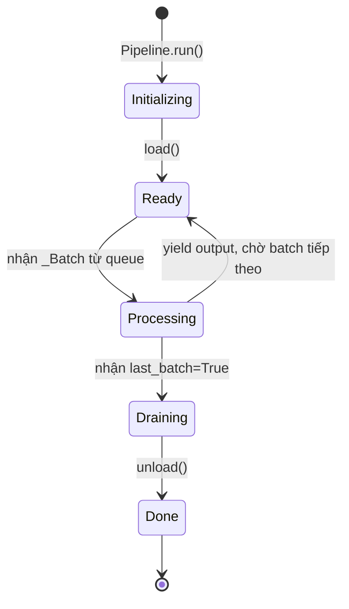

# Bài 3: Step Hierarchy & Vòng đời Step

## 1. Tại sao cần phân cấp Step?

Một pipeline tạo synthetic data thường gồm ba loại thao tác có bản chất rất khác nhau:

- **Nạp dữ liệu (loading)**: đọc từ file, database, hoặc HuggingFace Hub; không có input từ bước trước.
- **Biến đổi (transformation)**: nhận một batch nhỏ, xử lý từng hàng, trả về batch đã thêm cột mới.
- **Tích lũy (accumulation)**: cần toàn bộ dataset trước khi xử lý, ví dụ: clustering nhúng vector (embeddings), loại bỏ trùng lặp ngữ nghĩa (semantic deduplication).

Nếu dùng một lớp duy nhất cho cả ba loại, ta phải thêm cờ boolean và điều kiện đặc biệt vào mọi nơi. Thay vào đó, distilabel định nghĩa một hệ thống phân cấp rõ ràng trong `steps/base.py`, cho phép mỗi loại step khai báo khả năng của mình một cách tường minh thông qua kiểu.

## 2. `_Step`: Base Class và Schema Validation

`_Step` là lớp cơ sở cho tất cả các bước. Nó kế thừa từ `BaseModel` (Pydantic) và `_Serializable`, đảm bảo mỗi step có thể được serialize thành JSON/YAML để tái lập pipeline.

Hai thuộc tính trừu tượng quan trọng nhất là `inputs` và `outputs`, kiểu `list[str]`. Chúng khai báo schema của dữ liệu đầu vào và đầu ra. Trước khi pipeline chạy, distilabel kiểm tra tính nhất quán (consistency check): `outputs` của step trước phải là superset của `inputs` của step tiếp theo. Nếu không thỏa mãn, pipeline bị từ chối ngay tại thời điểm khởi tạo (eager validation), tránh lỗi xảy ra muộn ở giữa quá trình sinh dữ liệu tốn kém.

Tham số `input_batch_size` (mặc định 50, được định nghĩa là hằng `DEFAULT_INPUT_BATCH_SIZE`) điều khiển kích thước mỗi lô dữ liệu gửi vào `process()`. Giá trị này cân bằng giữa chi phí overhead per-batch và mức tiêu thụ bộ nhớ.

**StepResources** là dataclass cấu hình tài nguyên tính toán:

```python
from distilabel.steps import StepResources

step = MyStep(
    resources=StepResources(
        replicas=4,   # Số bản sao chạy song song
        gpus=1,       # GPU cần thiết mỗi replica
        cpus=2,       # CPU cores mỗi replica
        memory=None,  # RAM tính bằng bytes, None = không giới hạn
    )
)
```

Khi `replicas > 1`, BatchManager phân phối các batch đến các replica theo cơ chế round-robin, cho phép tận dụng tuyến tính của tài nguyên phần cứng.

## 3. `StepInput`: Annotation đặc biệt

```python
StepInput = Annotated[List[Dict[str, Any]], "_distilabel_step_input"]
```

`StepInput` không phải kiểu mới mà là `List[Dict[str, Any]]` được gắn metadata `"_distilabel_step_input"`. Annotation này phục vụ hai mục đích:

1. **Introspection**: distilabel dùng `typing.get_type_hints()` kết hợp `typing.get_args()` để phát hiện tham số nào trong signature của `process()` mang annotation này, từ đó biết cách inject batch đúng vị trí.
2. **Documentation**: làm rõ ý định của người viết step: tham số này là dữ liệu đến từ pipeline, không phải cấu hình.

## 4. `GeneratorStep`: Nguồn dữ liệu

`GeneratorStep` không có `inputs` (hoặc inputs là danh sách rỗng). Phương thức `process()` của nó là một **generator function** yield ra từng cặp `(batch, is_last_batch)`:

```python
def process(self, *args) -> GeneratorOutput:
    for chunk in self.data_source.iter_batches(self.batch_size):
        is_last = chunk.is_final
        yield chunk.to_dicts(), is_last
```

Cờ `is_last_batch: bool` là tín hiệu quan trọng. Khi `True`, BatchManager biết rằng GeneratorStep đã cạn dữ liệu và có thể bắt đầu quá trình drain: đẩy hết dữ liệu còn lại trong buffer qua các bước hạ lưu (downstream steps) để pipeline kết thúc sạch.

## 5. `Step` và `GlobalStep`

**`Step`** nhận `StepInput` (list of dicts), xử lý từng hàng hoặc từng batch, và yield lại list đã được bổ sung cột:

```python
from distilabel.steps import Step, StepInput
from distilabel.steps.typing import StepOutput

class AddColumn(Step):
    @property
    def inputs(self) -> list[str]:
        return ["text"]

    @property
    def outputs(self) -> list[str]:
        return ["text", "word_count"]

    def process(self, inputs: StepInput) -> StepOutput:
        for item in inputs:
            item["word_count"] = len(item["text"].split())
        yield inputs
```

**`GlobalStep`** đặt `accumulate = True`. Điều này khiến BatchManager không gửi từng batch nhỏ mà chờ cho đến khi nhận được `last_batch=True` từ tất cả các predecessor, rồi mới gửi toàn bộ dữ liệu tích lũy như một lô duy nhất. Đây là cơ chế bắt buộc cho các thao tác cần nhìn toàn cục như:

$$\text{MinHash dedup: } J(A, B) = \frac{|A \cap B|}{|A \cup B|} < \tau$$

trong đó $\tau$ là ngưỡng Jaccard similarity, và quyết định giữ/loại bỏ phụ thuộc vào toàn bộ tập dữ liệu.

## 6. Decorator `@step`

Decorator `@step` là factory function cho phép tạo Step từ plain Python function mà không cần khai báo class đầy đủ:

```python
from distilabel.steps import step, StepInput
from distilabel.steps.typing import StepOutput

@step(inputs=["text"], outputs=["text", "word_count"])
def add_word_count(inputs: StepInput) -> StepOutput:
    for item in inputs:
        item["word_count"] = len(item["text"].split())
    yield inputs
```

Bên trong, `@step` tạo ra một lớp con ẩn danh của `Step`, gán `inputs`/`outputs` từ tham số decorator, và wrap hàm thành phương thức `process()`. Cơ chế này giảm boilerplate đáng kể cho các step đơn giản.

## 7. Vòng đời của một Step



Phương thức `load()` được gọi một lần duy nhất trước khi step bắt đầu nhận data. Đây là nơi khởi tạo tài nguyên tốn kém như kết nối database, load model vào VRAM, hoặc mở file handle. Phương thức `unload()` được gọi khi step kết thúc, đảm bảo giải phóng tài nguyên đúng cách ngay cả khi pipeline bị ngắt giữa chừng.

Vòng lặp `process()` là trái tim của step: mỗi lần pipeline dispatch một `_Batch` vào queue của step, `process()` được gọi và yield ra batch đã xử lý. Với `replicas > 1`, mỗi replica chạy `process()` riêng biệt trong process con, nhận batch từ queue dùng chung.

## Tóm tắt

Hệ thống phân cấp Step của distilabel giải quyết tension giữa ba loại thao tác pipeline bằng cách encode khả năng vào kiểu dữ liệu thay vì runtime flags. `_Step` cung cấp schema validation sớm; `GeneratorStep` quản lý tín hiệu kết thúc qua `is_last_batch`; `GlobalStep` cho phép accumulation toàn cục; và decorator `@step` giảm boilerplate cho trường hợp đơn giản. Bài tiếp theo sẽ đi sâu vào tầng Task và LLM, nơi thao tác bất đồng bộ với mô hình ngôn ngữ trở thành trọng tâm.
