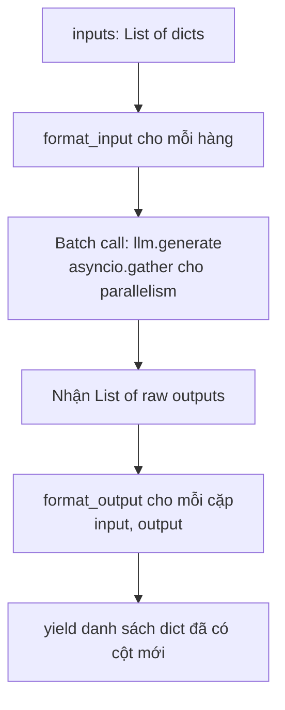

# Bài 4: Task & LLM Layer

## 1. Tension: Determinism vs. Non-determinism

Các `Step` thông thường trong distilabel là **deterministic**: cùng input luôn cho cùng output. Hàm đếm từ, regex extraction, hay JSON parsing đều có tính chất này. Nhưng Task cần giao tiếp với Large Language Model, và LLM có bản chất hoàn toàn khác:

- Cuộc gọi mạng có độ trễ cao và có thể thất bại.
- Cùng một prompt có thể cho nhiều kết quả khác nhau (khi `temperature > 0`).
- Một batch 50 hàng cần gọi LLM 50 lần, nhưng gọi tuần tự sẽ quá chậm.

Để giải quyết tension này, distilabel tách biệt tầng Task (định nghĩa *cách đặt câu hỏi cho LLM*) khỏi tầng LLM (định nghĩa *cách gọi model cụ thể*). Hai tầng này kết hợp thông qua composition, không phải kế thừa.

## 2. `_Task`: Lớp trừu tượng kế thừa `_Step`

`_Task` được định nghĩa trong `steps/tasks/base.py` và kế thừa `_Step`, nhưng bổ sung ba thuộc tính then chốt:

```python
class _Task(_Step, ABC):
    llm: LLM                    # Model sẽ được gọi
    num_generations: int = 1    # Số output sinh ra cho mỗi input
    group_generations: bool = True  # Gộp nhiều generation thành list hay giữ riêng
```

Khi `num_generations > 1`, mỗi hàng input tạo ra nhiều candidate output. Với `group_generations=True`, các generation này được gộp thành một danh sách trong cùng một hàng output. Điều này hữu ích khi cần best-of-N sampling hoặc diversity scoring.

## 3. Hai phương thức trừu tượng cốt lõi

### `format_input(input: dict) -> ChatType`

Phương thức này nhận một hàng dữ liệu (dict) và trả về danh sách messages theo định dạng chat:

```python
ChatType = List[Dict[str, str]]
# Ví dụ: [{"role": "system", "content": "..."}, {"role": "user", "content": "..."}]
```

Đây là nơi người dùng kiểm soát **prompt engineering**: cách đặt vấn đề, ngữ cảnh cung cấp cho model, cách format dữ liệu đầu vào thành ngôn ngữ tự nhiên.

### `format_output(output: str, input: dict) -> dict`

Phương thức này nhận raw text output từ LLM và parse thành dict có cấu trúc. Đây là nơi xử lý **output parsing**: extract JSON từ markdown code block, tách các phần theo delimiter, hoặc áp dụng regex để lấy trường cụ thể.

Tham số `input` được truyền vào để cho phép format_output tham chiếu dữ liệu gốc khi cần thiết, ví dụ: tính điểm tương đồng giữa output và input.

## 4. Luồng xử lý trong `process()`



Bước quan trọng là `llm.generate()` được gọi **một lần** cho toàn bộ batch, không phải từng hàng một. LLM base class tự động dùng `asyncio.gather()` ngầm để gọi `agenerate()` song song cho tất cả inputs trong batch. Điều này giảm tổng latency từ $O(n \cdot t)$ xuống xấp xỉ $O(t)$ với $n$ là số hàng và $t$ là thời gian một lần gọi LLM.

## 5. Ví dụ: Custom Task

```python
from distilabel.steps.tasks import Task
from distilabel.steps import StepInput
from distilabel.typing import ChatType

class Summarize(Task):
    system_prompt: str = "You are a summarization expert."

    @property
    def inputs(self) -> list[str]:
        return ["document"]

    @property
    def outputs(self) -> list[str]:
        return ["document", "summary"]

    def format_input(self, input: dict) -> ChatType:
        return [
            {"role": "system", "content": self.system_prompt},
            {"role": "user", "content": f"Summarize: {input['document']}"},
        ]

    def format_output(self, output: str, input: dict) -> dict:
        return {"summary": output}
```

## 6. `LLM` Base Class

`LLM` được định nghĩa trong `models/llms/base.py` và kế thừa `BaseModel` cùng `_Serializable`:

```python
class LLM(BaseModel, _Serializable, ABC):
    generation_kwargs: dict = {}          # temperature, max_tokens, top_p, v.v.
    use_offline_batch_generation: bool = False
```

Phương thức `generate()` là synchronous wrapper của `agenerate()`, hỗ trợ cả hai interface. Thuộc tính `model_name` là abstract property, buộc mọi implementation phải khai báo tên model để logging và caching.

Công thức chi phí dự kiến khi sampling $k$ generations với temperature $T$:

$$\mathbb{E}[\text{tokens}] = n \cdot k \cdot \bar{L}_{\text{output}}$$

trong đó $n$ là số hàng trong batch và $\bar{L}_{\text{output}}$ là độ dài trung bình output. Kiểm soát chi phí thông qua `num_generations` và `max_new_tokens` trong `generation_kwargs`.

## 7. Offline Batch Generation

Khi `use_offline_batch_generation=True`, pipeline không chờ LLM trả về kết quả ngay. Thay vào đó:

1. Tất cả requests được gửi lên API batch endpoint (hỗ trợ bởi OpenAI Batch API, Vertex AI Batch, v.v.).
2. `jobs_ids` được lưu vào disk (qua cơ chế cache của distilabel).
3. Pipeline có thể bị dừng và khởi động lại sau.
4. Khi pipeline chạy lại, LLM phát hiện `jobs_ids` tồn tại và thực hiện **polling** cho đến khi jobs hoàn thành.

Cơ chế này đặc biệt hữu ích khi budget API có giới hạn hoặc khi xử lý dataset lớn qua đêm với chi phí thấp hơn 50% so với realtime API.

## 8. Structured Output với Outlines

Distilabel tích hợp với thư viện Outlines để **constrain** generation của LLM theo JSON schema:

```python
from distilabel.steps.tasks import TextGeneration

task = TextGeneration(
    llm=my_llm,
    structured_output={
        "schema": {
            "type": "object",
            "properties": {
                "rating": {"type": "integer", "minimum": 1, "maximum": 5},
                "explanation": {"type": "string"}
            }
        }
    }
)
```

Khi sử dụng structured output, `format_output` có thể gọi `json.loads()` mà không cần try/except vì grammar-constrained decoding đảm bảo output luôn là JSON hợp lệ. Điều này loại bỏ một nguồn lỗi phổ biến khi làm việc với LLM.

## Tóm tắt

Tầng Task và LLM của distilabel giải quyết tension giữa determinism của pipeline và non-determinism của LLM thông qua hai cơ chế chính: (1) tách biệt rõ ràng `format_input`/`format_output` khỏi logic gọi model, và (2) parallelism ẩn qua `asyncio.gather()` trong base class. Offline batch generation và structured output là hai tính năng nâng cao giảm chi phí và tăng tính tin cậy của pipeline sản xuất. Bài tiếp theo sẽ đi sâu vào cơ chế BatchManager điều phối luồng dữ liệu giữa các step.
