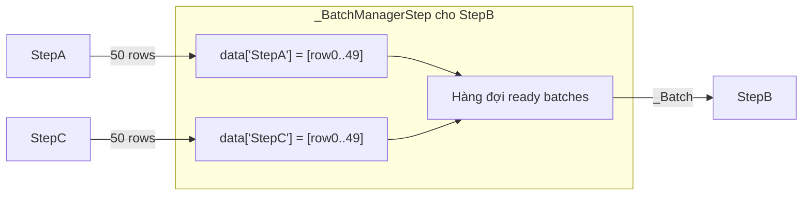
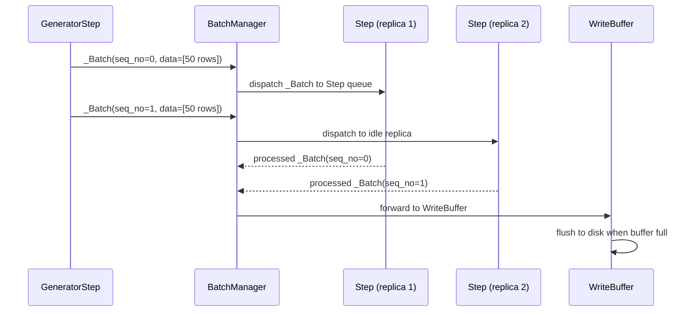

# Bài 5: BatchManager & Luồng Dữ liệu

## 1. Tension: Tốc độ không đồng đều giữa các Step

Trong một pipeline thực tế, các step có throughput rất khác nhau:

- `GeneratorStep` đọc từ disk: hàng triệu hàng/giây.
- `Step` gọi regex hoặc tokenizer: hàng chục nghìn hàng/giây.
- `Task` gọi LLM qua API: vài chục hàng/giây, bị giới hạn bởi rate limit.

Nếu không có cơ chế buffer và điều phối, bước nhanh sẽ flood bộ nhớ với dữ liệu chưa được xử lý, hoặc bước chậm sẽ để bước nhanh bị block. BatchManager là giải pháp: nó hoạt động như một **flow controller** phân tán, đảm bảo mỗi step nhận đúng lượng data nó có thể xử lý.

## 2. `_Batch`: Đơn vị vận chuyển dữ liệu

```python
@dataclass
class _Batch:
    step_name: str        # Step đích nhận batch này
    seq_no: int           # Số thứ tự trong chuỗi batch của step đó
    last_batch: bool      # True nếu đây là batch cuối cùng
    data: List[Dict]      # Dữ liệu thực tế
    created_from: dict    # Provenance: tên predecessor và seq_no của họ
```

Trường `seq_no` là khóa để duy trì **thứ tự output** ngay cả khi các step chạy song song với nhiều replica. Trường `created_from` lưu lại batch từ predecessor nào đã tạo ra batch này, cho phép BatchManager tái lập provenance sau khi routing.

Mỗi `_Batch` khi lan truyền qua pipeline tích lũy thêm thông tin trong `created_from`, tạo thành chuỗi lineage có thể truy vết về nguồn gốc ban đầu.

## 3. `_BatchManagerStep`: Buffer per-step



`_BatchManagerStep` duy trì một dict `data` ánh xạ từ tên predecessor sang danh sách rows đã nhận. Khi tổng số rows từ **tất cả predecessors** đạt `input_batch_size`, phương thức nội bộ được gọi để tạo một `_Batch` và đưa vào hàng đợi dispatch.

Trường `last_batch_received: list[str]` theo dõi những predecessor nào đã gửi tín hiệu kết thúc. Step chỉ được coi là đã nhận "last batch tổng thể" khi tất cả predecessors đều báo xong.

## 4. Trường hợp `GlobalStep`: Accumulation

`GlobalStep` đặt `accumulate=True`. Với cờ này, `_BatchManagerStep` hoạt động theo logic khác:

$$\text{Tạo batch} \iff \forall p \in \text{predecessors}: p \in \text{last\_batch\_received}$$

Tức là batch chỉ được tạo khi **tất cả** predecessors đã gửi tín hiệu kết thúc. Toàn bộ data tích lũy từ trước đến nay được gộp thành một lô duy nhất và gửi đến step. Sau đó, step xử lý và trả về kết quả trên toàn bộ dataset, ví dụ: deduplication dựa trên MinHash hay k-means clustering trên embeddings.

## 5. Convergence Step và Vấn đề Thứ tự

Khi pipeline có routing (một step gửi output tới nhiều nhánh song song rồi hội tụ lại), convergence step nhận data từ nhiều nguồn với `seq_no` khác nhau. BatchManager phải đảm bảo:

```
Nhánh A: seq_no=0, seq_no=1, seq_no=2, ...
Nhánh B: seq_no=0, seq_no=1, seq_no=2, ...
```

Convergence step chỉ tạo batch khi nhận đủ data cho cùng một `seq_no` từ tất cả nhánh đầu vào. Nếu nhánh A nhanh hơn và đã gửi `seq_no=2` trong khi nhánh B mới ở `seq_no=0`, data của nhánh A cho `seq_no=1` và `seq_no=2` được buffer lại trong `_BatchManagerStep` cho đến khi nhánh B bắt kịp. Không có batch nào bị mất thứ tự.

## 6. Luồng Batch qua Pipeline



Khi `replicas=2`, BatchManager duy trì hai queue riêng biệt. Nó dispatch batch tiếp theo đến replica nào đang rảnh (không có batch đang xử lý). Sau khi replica trả về processed batch, BatchManager forward kết quả theo thứ tự `seq_no` tăng dần đến WriteBuffer.

## 7. WriteBuffer: Ghi Kết quả ra Disk

WriteBuffer là sink cuối cùng của pipeline, nhận output từ tất cả leaf steps (step không có downstream). Nó hoạt động theo cơ chế **chunked write** để tránh giữ quá nhiều data trong RAM:

```python
# Giả lược hóa logic WriteBuffer
class WriteBuffer:
    def add(self, batch: _Batch):
        self.buffer.extend(batch.data)
        if len(self.buffer) >= self.chunk_size:
            self._flush_to_disk()

    def _flush_to_disk(self):
        # Ghi ra file Parquet hoặc JSON theo chunk
        self.filesystem.write(self.path, self.buffer)
        self.buffer.clear()
```

Sau khi tất cả leaf steps báo `last_batch=True`, WriteBuffer flush phần còn lại và tổng hợp thành `Distiset`, một subclass của `DatasetDict` của HuggingFace, với metadata bao gồm pipeline config và reproducibility info.

## 8. fsspec Abstraction cho Storage Backend

Distilabel dùng `fsspec.AbstractFileSystem` để trừu tượng hóa storage backend:

| Backend | URI prefix | Cấu hình thêm |
|---|---|---|
| Local disk | `file://` hoặc đường dẫn thông thường | Không cần |
| Amazon S3 | `s3://bucket/path` | `s3fs` + AWS credentials |
| Google Cloud Storage | `gs://bucket/path` | `gcsfs` + service account |
| Azure Blob Storage | `az://container/path` | `adlfs` + connection string |

Cú pháp sử dụng:

```python
pipeline.run(
    storage_parameters={
        "path": "s3://my-bucket/synthetic-data/",
        "storage_options": {"key": "...", "secret": "..."}
    }
)
```

Nhờ fsspec, toàn bộ logic WriteBuffer và cache đều hoạt động với bất kỳ backend nào mà không cần thay đổi code pipeline.

## Tóm tắt

BatchManager là hệ thần kinh trung ương của distilabel pipeline. `_Batch` mang `seq_no` và `created_from` để đảm bảo thứ tự và truy vết provenance. `_BatchManagerStep` buffer data từ nhiều predecessors và tạo batch khi đủ `input_batch_size`, trong khi `GlobalStep` với `accumulate=True` chờ toàn bộ predecessors hoàn thành. WriteBuffer với fsspec abstraction đảm bảo kết quả được ghi ra bất kỳ storage backend nào một cách tin cậy. Ba lớp này cùng nhau cho phép pipeline chạy với throughput cao trên hardware không đồng nhất mà vẫn duy trì tính nhất quán của dữ liệu.
