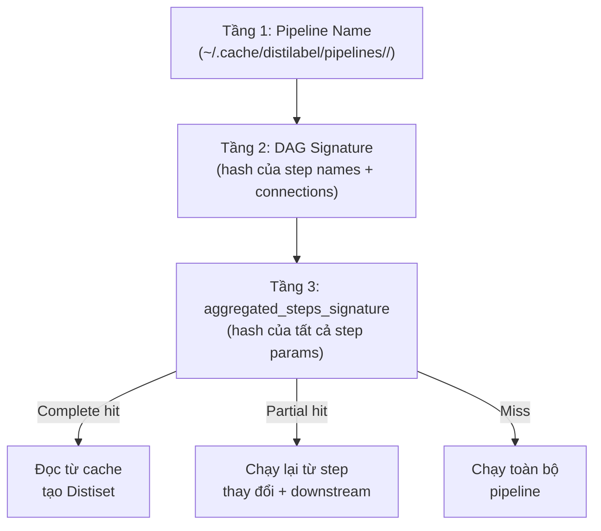

# Bài 6: Caching và Serialization trong distilabel

## 1. Vấn đề: Chi phí thất bại giữa chừng

Một pipeline sinh dữ liệu tổng hợp quy mô lớn có thể chạy hàng chục giờ, tiêu tốn hàng trăm đô la phí API. Giả sử pipeline có 10 step, mỗi step xử lý 50.000 mẫu, và hệ thống crash tại step 7 do lỗi mạng hoặc out-of-memory. Không có cơ chế phục hồi, toàn bộ công sức tính toán từ step 1 đến step 6 sẽ bị mất hoàn toàn.

Chi phí tổn thất ước tính khi không có caching:

$$C_{\text{loss}} = \sum_{i=1}^{k} \text{cost}(S_i)$$

trong đó $k$ là số step đã hoàn thành trước khi crash, $\text{cost}(S_i)$ là chi phí API hoặc tính toán của step $i$. distilabel giải quyết bài toán này thông qua một cơ chế caching ba tầng với hash-based invalidation.

## 2. Kiến trúc cache ba tầng

distilabel xác định cache hit hay miss thông qua ba cấp độ định danh lồng nhau:



**Tầng 1 (Pipeline Name):** Mỗi pipeline được định danh bởi tên chuỗi truyền vào constructor. Thư mục `~/.cache/distilabel/pipelines/<pipeline_name>/` được tạo ra để chứa toàn bộ cache cho pipeline đó.

**Tầng 2 (DAG Signature):** Hash SHA-256 được tính trên cấu trúc DAG, bao gồm tên các step và các cạnh kết nối giữa chúng. Nếu topology thay đổi (thêm/bỏ step, thay đổi thứ tự kết nối), signature này thay đổi và cache tầng 2 bị vô hiệu.

**Tầng 3 (aggregated\_steps\_signature):** Hash tổng hợp của tất cả tham số cấu hình của mọi step trong pipeline. Đây là tầng kiểm tra chi tiết nhất: thay đổi `temperature` của một LLM hay `batch_size` của một step đều kích hoạt invalidation.

## 3. Partial Cache Hit và Resume

Trường hợp quan trọng nhất là **partial hit**: DAG signature khớp nhưng một số step có params thay đổi. distilabel xác định tập hợp các step bị ảnh hưởng và chạy lại chúng cùng toàn bộ downstream steps. Điều này đảm bảo tính nhất quán dữ liệu: không thể có output từ step $S_j$ được tính với params mới nhưng input đến từ output cũ của step $S_{j-1}$.

Để bật/tắt cache ở pipeline level:

```python
# Tắt cache hoàn toàn
distiset = pipeline.run(use_cache=False)

# Mặc định: use_cache=True
distiset = pipeline.run()
```

Để override cache ở step level, mỗi `Step` có thuộc tính `use_cache`:

```python
generate = TextGeneration(
    llm=...,
    use_cache=False,  # Step này luôn chạy lại
)
```

## 4. Cấu trúc thư mục cache

```
~/.cache/distilabel/pipelines/
└── <pipeline_name>/
    └── <dag_signature>/
        └── <aggregated_steps_signature>/
            ├── pipeline.json          # Toàn bộ config pipeline
            ├── batch_manager.json     # Trạng thái BatchManager
            ├── steps_data/            # Output trung gian từng step
            │   ├── load_data/
            │   ├── generate/
            │   └── score/
            └── data/                  # Dataset cuối cùng (Parquet)
```

`pipeline.json` lưu serialized form của toàn bộ pipeline, đủ để reconstruct lại pipeline y hệt. `batch_manager.json` là file quan trọng nhất cho recovery: nó lưu trạng thái của `BatchManager` tại thời điểm checkpoint cuối cùng, bao gồm thông tin batch nào đã xử lý xong, batch nào đang dở dang. Khi resume, pipeline đọc file này và tiếp tục từ đúng điểm dừng.

## 5. Lớp `_Serializable` và hệ thống serialization

Tất cả components trong distilabel (Step, Task, LLM, Pipeline) đều kế thừa từ mixin `_Serializable`, kết hợp với Pydantic `BaseModel`. Điều này mang lại hai khả năng:

**Dump sang JSON/dict:**

```python
step_config = generate.dump_json()          # Trả về chuỗi JSON
step_dict  = generate.load_from_dict(...)   # Tái tạo từ dict
```

**Lưu và tải pipeline:**

```python
# Lưu toàn bộ pipeline thành file YAML để chia sẻ
pipeline.save("my_pipeline.yaml", format="yaml")

# Tải lại trên máy khác
from distilabel.pipeline import Pipeline
pipeline = Pipeline.load("my_pipeline.yaml")
```

Pipeline serialization đặc biệt hữu ích cho việc chia sẻ và tái tạo thí nghiệm. Một file YAML duy nhất mô tả toàn bộ topology, tham số cấu hình, và LLM backend, cho phép bất kỳ ai reproduce pipeline mà không cần đọc code gốc.

## 6. Cơ chế resume từ checkpoint

Khi pipeline khởi động lại sau crash, quy trình diễn ra như sau:

$$\text{Step}_{\text{resume}} = \min\{i : \text{batch\_manager.json chỉ ra step } i \text{ chưa hoàn thành}\}$$

Cụ thể, distilabel thực hiện:

1. Kiểm tra ba tầng signature, xác định đây là resume hay run mới
2. Deserialize `batch_manager.json` để khôi phục trạng thái `BatchManager`
3. Đọc lại output đã có từ `steps_data/` cho các step đã hoàn thành
4. Bắt đầu lại luồng xử lý từ step chưa hoàn thành, đưa đúng batch vào đúng queue

Nhờ kiến trúc này, khi pipeline của bạn crash ở step 7/10 sau 6 giờ chạy, lần chạy tiếp theo sẽ bỏ qua step 1 đến 6 và tiếp tục từ step 7, tiết kiệm toàn bộ chi phí tính toán đã bỏ ra.

## 7. Tóm tắt

| Cơ chế | Mục đích | Khi nào dùng |
|---|---|---|
| Three-tier cache | Tránh recompute pipeline không đổi | Mặc định bật |
| Partial cache hit | Resume từ step thay đổi | Khi tune params từng bước |
| `pipeline.save()` | Chia sẻ pipeline config | Reproducibility, collaboration |
| `use_cache=False` | Force rerun | Debug, test với dữ liệu mới |

Việc hiểu rõ cơ chế ba tầng giúp người dùng chủ động kiểm soát khi nào cần invalidate cache và khi nào có thể tận dụng checkpoint, tối ưu cả chi phí lẫn thời gian thực thi.
