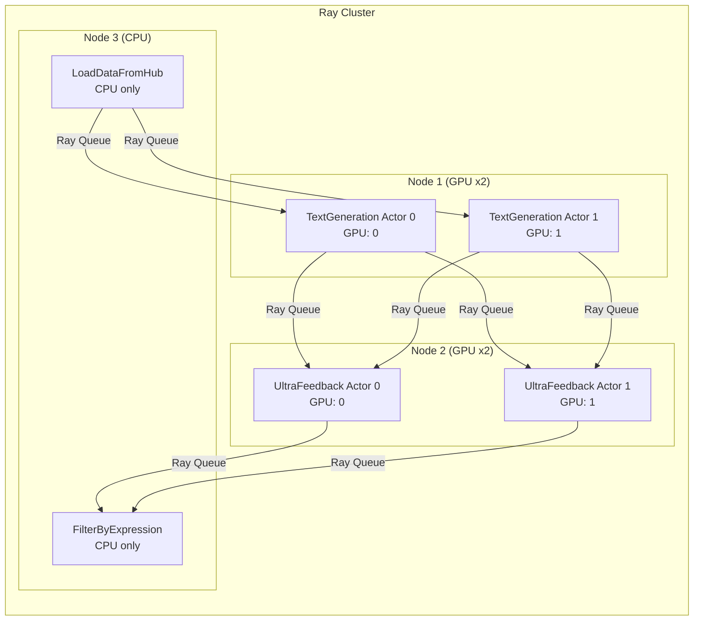

# Bài 7: Scaling với Ray

## 1. Giới hạn của local multiprocessing

Pipeline mặc định của distilabel sử dụng `multiprocessing.Queue` để truyền batch dữ liệu giữa các step, với mỗi step chạy trong một process riêng biệt trên cùng một máy. Mô hình này đơn giản và hiệu quả với pipeline nhỏ, nhưng gặp hai giới hạn cơ bản:

**Giới hạn phần cứng:** Toàn bộ workers bị giam cầm trong boundary của một node vật lý. Khi cần chạy model 70B+ đòi hỏi nhiều GPU, hoặc khi throughput yêu cầu 10 replica song song cho một step, single-machine multiprocessing không đáp ứng được.

**Giới hạn fault tolerance:** Process crash trên local machine không có cơ chế tự phục hồi ở tầng execution. Ray giải quyết cả hai vấn đề bằng cách phân phối workload ra cluster nhiều node với scheduler chuyên dụng và actor model cho state management.

## 2. Step-as-Ray-Actor Pattern

`RayPipeline` ánh xạ mỗi Step instance thành một **Ray Actor**, một đơn vị tính toán stateful trong Ray:



Lý do dùng Actor thay vì remote function thuần túy: Actor duy trì trạng thái giữa các lần gọi. Điều này rất quan trọng vì `load()` của một LLM step nạp hàng chục GB model weights vào VRAM. Nếu dùng stateless function, weights phải nạp lại với mỗi batch, hoàn toàn không chấp nhận được.

## 3. Vòng đời Step trong Ray

Mỗi Step Actor trải qua ba giai đoạn:

**Giai đoạn Load:** Actor được khởi tạo, phương thức `load()` được gọi một lần. Với LLM step, đây là lúc model weights được nạp vào GPU memory (hoặc kết nối đến Inference Endpoint).

**Giai đoạn Batch Loop:** Actor liên tục nhận batch từ input Ray Queue, gọi `process()`, và đẩy kết quả vào output Ray Queue. Vòng lặp này chạy cho đến khi nhận được tín hiệu kết thúc.

**Giai đoạn Unload:** Phương thức `unload()` được gọi để giải phóng resources. Actor sau đó bị terminated bởi Ray.

Quá trình này đảm bảo chi phí `load()` chỉ xảy ra một lần cho toàn bộ pipeline run, bất kể có bao nhiêu batch cần xử lý.

## 4. Cấu hình resources

Mỗi Step trong `RayPipeline` chấp nhận dictionary `resources` để khai báo yêu cầu tài nguyên:

```python
from distilabel.pipeline import RayPipeline
from distilabel.steps.tasks import TextGeneration, UltraFeedback
from distilabel.models import vLLM

with RayPipeline("ray-sft-pipeline") as pipeline:
    generate = TextGeneration(
        llm=vLLM(
            model="meta-llama/Meta-Llama-3.1-8B-Instruct",
            tensor_parallel_size=2,
        ),
        resources={
            "replicas": 4,   # 4 Actor instances song song
            "gpus": 2,       # Mỗi Actor yêu cầu 2 GPU
            "cpus": 4,       # CPU cores cho preprocessing
            "memory": "32GB",
        },
    )
```

Tổng GPU cần thiết cho step này: $4 \times 2 = 8$ GPU. Ray scheduler sẽ tự động phân bổ các Actor lên các node có đủ tài nguyên.

## 5. Triển khai với Ray Jobs API

Để chạy pipeline trên Ray cluster đã có sẵn:

```python
# runtime_env.yaml
# pip:
#   - distilabel[ray]>=1.4.0
#   - vllm>=0.5.0

import ray
ray.init("ray://<head-node-ip>:10001")

distiset = pipeline.run()
```

Hoặc submit qua Ray Jobs API:

```bash
ray job submit \
  --address http://<head-node-ip>:8265 \
  --runtime-env runtime_env.yaml \
  -- python run_pipeline.py
```

## 6. Slurm + Ray: Cluster tạm thời

Trên HPC cluster dùng Slurm, pattern phổ biến là tạo Ray cluster tạm thời trong một Slurm job:

```bash
#!/bin/bash
#SBATCH --job-name=distilabel-ray
#SBATCH --nodes=4
#SBATCH --ntasks-per-node=1
#SBATCH --gpus-per-node=8

# Node đầu tiên làm head
HEAD_NODE=$(scontrol show hostnames "$SLURM_JOB_NODELIST" | head -n 1)
HEAD_NODE_IP=$(srun --nodes=1 --ntasks=1 -w "$HEAD_NODE" hostname --ip-address)

# Khởi động Ray head
srun --nodes=1 --ntasks=1 -w "$HEAD_NODE" \
    ray start --head --port=6379 --block &

# Khởi động Ray workers trên các node còn lại
srun --nodes=3 --ntasks=3 --exclude="$HEAD_NODE" \
    ray start --address="${HEAD_NODE_IP}:6379" --block &

wait
python run_pipeline.py
```

## 7. vLLM với tensor parallelism trên Ray

Khi một model quá lớn để vừa trong một GPU, vLLM hỗ trợ tensor parallelism phân tán qua Ray backend:

```python
from distilabel.models import vLLM

llm = vLLM(
    model="meta-llama/Meta-Llama-3.1-70B-Instruct",
    tensor_parallel_size=4,           # Chia model ra 4 GPU
    distributed_executor_backend="ray",  # Ray làm communication backend
    generation_kwargs={
        "max_new_tokens": 1024,
        "temperature": 0.7,
    },
)
```

Với `tensor_parallel_size=4`, mỗi GPU giữ $\frac{1}{4}$ tổng trọng số model. Các tensor operations được chia nhỏ và thực hiện song song, kết quả được all-reduce sau mỗi layer. Ray quản lý communication giữa các GPU process, thay thế cho NCCL trong môi trường multi-node.

## 8. So sánh Pipeline và RayPipeline

| Tiêu chí | `Pipeline` (local) | `RayPipeline` |
|---|---|---|
| Backend | `multiprocessing.Queue` | Ray Actor + Ray Queue |
| Scale | Single machine | Multi-node cluster |
| Fault tolerance | Không | Ray có checkpoint tự động |
| Setup complexity | Không cần | Cần Ray cluster |
| Phù hợp với | Prototype, dataset nhỏ | Production, dataset lớn |

API của `RayPipeline` hoàn toàn tương thích với `Pipeline`: cùng cú pháp `>>`, cùng `.run()`, cùng `Distiset` output. Chỉ cần thay đổi một dòng import để chuyển từ local sang distributed.
