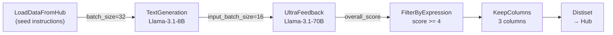

# Bài 8: Thực hành - Xây dựng Pipeline SFT End-to-End

## 1. Mục tiêu và bối cảnh

Supervised Fine-Tuning (SFT) là bước đầu tiên trong hầu hết các quy trình alignment hiện đại. Để SFT có hiệu quả, tập dữ liệu huấn luyện cần thỏa mãn hai điều kiện: **câu lệnh (instruction) đa dạng** và **phản hồi (response) chất lượng cao**. Bài thực hành này xây dựng một pipeline năm bước để tự động hóa toàn bộ quá trình, từ seed data thô trên HuggingFace Hub đến dataset đã lọc sẵn sàng cho fine-tuning.

Kiến trúc tổng thể của pipeline:



Điểm đáng chú ý: step `UltraFeedback` dùng model lớn hơn (70B) làm judge để đánh giá output của model nhỏ hơn (8B). Đây là pattern **LLM-as-Judge** tiêu chuẩn trong nghiên cứu alignment.

## 2. Code pipeline đầy đủ

```python
from distilabel.models import InferenceEndpointsLLM
from distilabel.pipeline import Pipeline
from distilabel.steps import LoadDataFromHub, FilterByExpression
from distilabel.steps.tasks import TextGeneration, UltraFeedback
from distilabel.steps.columns import KeepColumns

with Pipeline("sft-pipeline") as pipeline:
    # Bước 1: Load seed data
    load_data = LoadDataFromHub(
        repo_id="HuggingFaceH4/instruction-dataset",
        split="train",
        batch_size=32,
    )

    # Bước 2: Generate responses
    generate = TextGeneration(
        llm=InferenceEndpointsLLM(
            model_id="meta-llama/Meta-Llama-3.1-8B-Instruct",
            generation_kwargs={"temperature": 0.7, "max_new_tokens": 512},
        ),
        input_batch_size=16,
        num_generations=1,
    )

    # Bước 3: Score với UltraFeedback
    score = UltraFeedback(
        llm=InferenceEndpointsLLM(
            model_id="meta-llama/Meta-Llama-3.1-70B-Instruct",
        ),
        aspect="instruction-following",
    )

    # Bước 4: Lọc chất lượng
    filter_step = FilterByExpression(
        expression="overall_score >= 4",
    )

    # Bước 5: Giữ columns cần thiết
    keep = KeepColumns(
        columns=["instruction", "generation", "overall_score"],
    )

    load_data >> generate >> score >> filter_step >> keep

distiset = pipeline.run()
distiset.push_to_hub("my-org/sft-dataset-llama3")
```

## 3. Phân tích từng bước

### Bước 1: LoadDataFromHub

`LoadDataFromHub` là một `GeneratorStep`, nguồn dữ liệu đầu vào không nhận upstream input. Tham số `batch_size=32` kiểm soát số row được phát ra mỗi lần. Dataset `HuggingFaceH4/instruction-dataset` chứa các instruction đa dạng thu thập từ nhiều nguồn, phù hợp làm seed.

Lưu ý quan trọng: `batch_size` của `LoadDataFromHub` nên lớn hơn hoặc bằng `input_batch_size` của bước tiếp theo để tránh tình trạng upstream starvation, trong đó downstream step phải chờ quá lâu giữa các batch.

### Bước 2: TextGeneration

`TextGeneration` gọi `format_input()` để chuyển mỗi instruction thành chat format trước khi truyền cho LLM:

$$\text{messages} = [\{"role": "user", "content": \text{instruction}\}]$$

Tham số `num_generations=1` chỉ sinh một response mỗi instruction. Khi cần SFT với nhiều lựa chọn (cho DPO sau này), có thể đặt `num_generations=2` hoặc cao hơn. Output column mặc định là `generation`.

### Bước 3: UltraFeedback (LLM-as-Judge)

`UltraFeedback` implement scheme đánh giá từ paper UltraFeedback (Cui et al., 2023). Với `aspect="instruction-following"`, judge model đánh giá mức độ response tuân theo instruction trên thang điểm 1 đến 5, kèm theo `generation_model` và `generation_params` để truy xuất ngữ cảnh.

Output columns được thêm vào mỗi row:
- `ratings`: điểm từng generation
- `rationales`: lý giải của judge
- `overall_score`: điểm trung bình

### Bước 4: FilterByExpression

`FilterByExpression` đánh giá biểu thức Python trên mỗi row và chỉ giữ lại các row thỏa điều kiện. Biểu thức `"overall_score >= 4"` loại bỏ khoảng 40 đến 60% dữ liệu tùy dataset, giữ lại phần chất lượng cao.

Ngưỡng 4/5 tương ứng với "response mostly follows instruction with minor issues". Nếu pipeline downstream là RLHF/DPO, có thể dùng ngưỡng thấp hơn và giữ cả cặp chosen/rejected.

### Bước 5: KeepColumns

`KeepColumns` loại bỏ tất cả metadata trung gian (rationales, ratings, các annotation columns) và chỉ giữ lại ba columns cần thiết cho SFT. Điều này giảm kích thước file cuối cùng và tránh nhầm lẫn khi dùng dataset.

## 4. Debug với dry_run

Trước khi chạy toàn bộ pipeline tốn kém, luôn kiểm tra với `dry_run`:

```python
# Chạy thử với 10 batch đầu tiên
distiset = pipeline.run(
    dry_run=True,
    batch_count=10,
)
```

`dry_run=True` kết hợp với `batch_count=N` cho phép pipeline xử lý đúng $N$ batch đầu tiên rồi dừng lại. Đây là cách hiệu quả để:
1. Kiểm tra format input/output của từng step
2. Phát hiện lỗi schema (column name sai, kiểu dữ liệu không khớp)
3. Ước tính throughput thực tế trước khi scale

Sau `dry_run`, kiểm tra output:

```python
# Xem schema và vài rows đầu
print(distiset["keep_columns_0"]["train"].features)
print(distiset["keep_columns_0"]["train"][:3])
```

## 5. Các pitfalls thường gặp

**Pitfall 1: Mismatch batch_size giữa các step.** `LoadDataFromHub` phát batch 32 nhưng `TextGeneration` có `input_batch_size=16`. distilabel xử lý điều này tự động thông qua `BatchManager`, nhưng cấu hình không nhất quán có thể gây ra idle time. Tốt nhất nên để `input_batch_size` là ước của `batch_size` upstream.

**Pitfall 2: Token budget cho UltraFeedback.** Judge model phải đọc cả instruction lẫn response trong prompt. Nếu `max_new_tokens` ở bước 2 quá lớn (ví dụ 2048), prompt gửi đến judge có thể vượt context limit của Inference Endpoint. Giới hạn `max_new_tokens <= 512` là an toàn cho hầu hết judge models.

**Pitfall 3: `overall_score` là None.** Khi judge LLM trả về output không parse được (JSON malformed), `overall_score` có thể là `None`. Biểu thức `"overall_score >= 4"` sẽ raise `TypeError`. Cần filter `None` trước: `"overall_score is not None and overall_score >= 4"`.

## 6. Ước tính chi phí

Giả sử dataset seed có $N = 10{,}000$ instructions, mỗi instruction trung bình 50 tokens, mỗi response 300 tokens:

$$\text{Token}_{\text{generate}} = N \times (50 + 300) = 3{,}500{,}000 \text{ tokens}$$

$$\text{Token}_{\text{judge}} \approx N \times (50 + 300 + 200_{\text{prompt overhead}}) \approx 5{,}500{,}000 \text{ tokens}$$

Tổng chi phí phụ thuộc vào backend. Với HuggingFace Inference Endpoints serverless, giá tham khảo (tháng 6/2025) cho Llama-3.1-70B khoảng $0.9/1M tokens. Pipeline trên sẽ tiêu tốn khoảng $5 cho toàn bộ 10.000 samples.

## 7. Push to Hub và sử dụng

```python
distiset.push_to_hub(
    "my-org/sft-dataset-llama3",
    private=True,
    commit_message="SFT dataset: Llama-3.1-8B responses, UltraFeedback filtered >= 4",
)
```

Dataset được upload dưới dạng Parquet files, tương thích trực tiếp với `datasets.load_dataset()`. Từ đây, có thể dùng với bất kỳ SFT framework nào (TRL, LLaMA-Factory, Axolotl) mà không cần preprocessing thêm.

## 8. Tóm tắt

Pipeline năm bước này minh họa vòng lặp cơ bản của synthetic data generation: **Seed → Generate → Judge → Filter → Export**. Mỗi step có trách nhiệm rõ ràng và có thể thay thế độc lập. Ví dụ, bước 3 có thể thay bằng `PrometheusEval` hay `ArenaHard` tùy yêu cầu đánh giá. Bước 2 có thể chạy với `num_generations=2` để tạo dữ liệu cho DPO thay vì SFT thuần.
