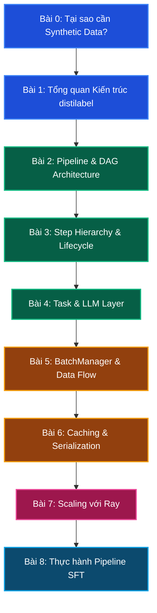

# Lộ trình học tập distilabel

## Giới thiệu

Curriculum này trình bày distilabel từ nền tảng lý thuyết đến triển khai thực tế theo lộ trình tuyến tính. Mỗi bài xây dựng trên kiến thức của bài trước: không thể hiểu cơ chế caching (Bài 6) nếu chưa nắm BatchManager (Bài 5), và không thể debug pipeline Ray (Bài 7) nếu chưa hiểu vòng đời Step (Bài 3).

Curriculum gồm bốn phần lớn, tương ứng với bốn mức độ hiểu biết khác nhau về hệ thống.

## Sơ đồ học tập

**Chú thích màu sắc:**
- Xanh dương: Phần I - Background
- Xanh lá: Phần II - Core Theory
- Vàng/Nâu: Phần III - Deep Dive Code
- Hồng/Tím: Phần IV - Optimization & Practice

---

## Phần I: Background (Bài 0 - 1)

Phần này trả lời câu hỏi "tại sao" trước khi đi vào câu hỏi "như thế nào". Học viên cần hiểu rõ vị trí của synthetic data trong pipeline nghiên cứu AI hiện đại, và cấu trúc module cấp cao của distilabel, trước khi đi vào chi tiết kỹ thuật.

### [Bài 0: Tại sao cần Synthetic Data?](lesson_0_why_synthetic_data)

- Phân tích giới hạn của human-annotated data về chi phí, quy mô và tốc độ
- So sánh ba paradigm tạo dữ liệu: human annotation, web scraping, và LLM-generated synthetic data
- Trình bày các use case thực tế: Alpaca, Self-Instruct, UltraChat, Magpie
- Giải thích vòng lặp self-improvement: dùng LLM mạnh để tạo dữ liệu huấn luyện LLM yếu hơn
- Thảo luận về rủi ro của synthetic data: model collapse, distribution shift, bias amplification
- Định vị distilabel: reproducibility, caching, scalability, research-backed algorithms

### [Bài 1: Tổng quan Kiến trúc distilabel](lesson_1_architecture_overview)

- Cấu trúc module: `pipeline/`, `steps/`, `models/`, `distiset.py`
- Ba tầng kiến trúc: Pipeline (orchestrator), Steps/Tasks (workers), LLMs (backends)
- `Distiset` là subclass của `dict`, cấu trúc key là tên leaf step
- `RuntimeParameter` và `RuntimeParametersMixin` cho hyperparameter override lúc chạy
- Serialization pipeline thành YAML/JSON để reproducibility và chia sẻ

---

## Phần II: Core Theory (Bài 2 - 4)

Phần này đi sâu vào ba thành phần cốt lõi của hệ thống. Đây là phần quan trọng nhất về mặt lý thuyết, cung cấp mental model cần thiết để đọc source code và debug hiệu quả.

### [Bài 2: Pipeline & DAG Architecture](lesson_2_pipeline_dag_architecture)

- `networkx.DiGraph` là backing structure của DAG trong distilabel
- Context manager pattern và `_GlobalPipelineManager`: cơ chế auto-registration của Step khi dùng `with Pipeline(...) as pipeline:`
- Toán tử `>>` implement `__rshift__` để build DAG edges theo cú pháp khai báo
- Validation tại build time: phát hiện cycle, type mismatch giữa input/output columns
- `BasePipeline` vs `Pipeline` vs `RayPipeline`: lớp trừu tượng và các implementation cụ thể
- `routing_batch_function` để điều hướng batch có điều kiện sang các nhánh khác nhau

### [Bài 3: Step Hierarchy & Lifecycle](lesson_3_step_hierarchy)

- Phân cấp kế thừa: `_Step` (base) -> `GeneratorStep` / `Step` / `GlobalStep` / `Task`
- Vòng đời một Step: `load()` -> `process()` -> `unload()` và ý nghĩa mỗi giai đoạn
- `input_mappings` và `output_mappings`: rename columns mà không cần subclass mới
- `Step.process()` là generator function, `yield` từng batch để backpressure control
- Decorator `@step` để tạo custom step nhanh từ plain Python function
- `StepResources`: khai báo replicas, gpus, cpus cho mỗi Step

### [Bài 4: Task & LLM Layer](lesson_4_task_llm_layer)

- `Task` là subclass của `Step` tích hợp một `LLM` instance
- Hai phương thức trừu tượng: `format_input()` trả về `ChatType`, `format_output()` parse raw string
- Lớp `LLM` trừu tượng với phương thức duy nhất `generate(inputs, **kwargs) -> GenerateOutput`
- So sánh các backend: `InferenceEndpointsLLM`, `OpenAILLM`, `vLLM`, `LiteLLM`, `OllamaLLM`
- Structured output với `StructuredOutputConfig` và JSON Schema validation
- Cách viết custom Task và custom LLM backend

---

## Phần III: Deep Dive Code (Bài 5 - 6)

Phần này phân tích hai cơ chế nội bộ quan trọng nhất của distilabel: quản lý luồng dữ liệu giữa các step và hệ thống caching/recovery. Đây là kiến thức cần thiết để tối ưu performance và xử lý sự cố trên production.

### [Bài 5: BatchManager & Data Flow](lesson_5_batch_manager_data_flow)

- `BatchManager` là thành phần điều phối trung tâm giữa các Step trong pipeline
- Cơ chế buffering: accumulate batches từ nhiều upstream steps trước khi dispatch downstream
- `multiprocessing.Queue` là transport layer giữa Step processes trên local pipeline
- Backpressure mechanism: downstream step chưa sẵn sàng thì upstream tạm dừng phát batch
- `_Batch` dataclass: cấu trúc dữ liệu cơ bản với `seq_no`, `last_batch`, `data` fields
- `WriteBuffer` gom kết quả từ leaf steps và ghi Parquet files ra disk
- Đảm bảo thứ tự batch với `seq_no` tại convergence points sau `routing_batch_function`

### [Bài 6: Caching & Serialization](lesson_6_caching_serialization)

- Ba tầng cache: pipeline name, DAG signature (hash topology), aggregated\_steps\_signature (hash params)
- Hash-based invalidation: khi nào cache hit hoàn toàn, khi nào partial hit, khi nào miss
- Partial cache hit: chỉ chạy lại step có params thay đổi và toàn bộ downstream steps
- Cấu trúc thư mục cache: `pipeline.json`, `batch_manager.json`, `steps_data/`, `data/`
- Cơ chế resume từ checkpoint: đọc `batch_manager.json`, tiếp tục từ đúng điểm dừng
- `_Serializable` mixin: `dump_json()`, `load_json()`, `load_from_dict()` cho mọi component
- `pipeline.save()` và `Pipeline.load()` để share và reproduce experiments

---

## Phần IV: Optimization & Practice (Bài 7 - 8)

Phần cuối chuyển từ lý thuyết sang triển khai quy mô lớn. Bài 7 giải quyết bài toán scaling ra multi-node cluster. Bài 8 là tutorial thực hành xây dựng SFT dataset end-to-end.

### [Bài 7: Scaling với Ray](lesson_7_scaling_with_ray)

- Giới hạn của local `multiprocessing`: single-machine, không có fault tolerance tự động
- `RayPipeline`: mỗi Step replica là một Ray Actor, duy trì state giữa các batch
- Vòng đời Step Actor: `load()` một lần -> batch loop -> `unload()` khi pipeline kết thúc
- Cấu hình resources: `replicas`, `gpus`, `cpus`, `memory` trong dictionary `resources`
- Ray Jobs API: submit pipeline lên Ray cluster đã có sẵn qua HTTP
- Slurm + Ray: pattern tạo Ray cluster tạm thời trong Slurm job cho HPC environment
- vLLM với `tensor_parallel_size` và `distributed_executor_backend="ray"` cho model 70B+
- So sánh `Pipeline` và `RayPipeline`: API tương thích hoàn toàn, chỉ khác execution backend

### [Bài 8: Thực hành - Pipeline SFT](lesson_8_practical_sft_pipeline)

- Xây dựng pipeline năm bước: Load -> Generate -> Judge -> Filter -> Export
- `LoadDataFromHub` làm seed, `TextGeneration` với Llama-3.1-8B tạo responses
- `UltraFeedback` với Llama-3.1-70B làm LLM-as-Judge, `aspect="instruction-following"`
- `FilterByExpression` với ngưỡng `overall_score >= 4` loại bỏ responses chất lượng thấp
- `KeepColumns` để giảm kích thước và làm sạch schema dataset cuối cùng
- Debug workflow với `dry_run=True` và `batch_count=N` trước khi chạy toàn bộ
- Các pitfalls thường gặp: `None` scores, token budget vượt giới hạn, batch\_size mismatch
- Ước tính chi phí API và `distiset.push_to_hub()` lên HuggingFace Hub

---

## Điều kiện tiên quyết

Để theo dõi curriculum này hiệu quả, học viên cần:

- Hiểu biết cơ bản về Python và lập trình hướng đối tượng
- Quen thuộc với HuggingFace `datasets` library và khái niệm `DatasetDict`
- Hiểu biết cơ bản về LLM inference (temperature, max\_new\_tokens, chat format)
- Đã từng dùng ít nhất một LLM API (OpenAI, HuggingFace, hoặc tương đương)

Kiến thức về Ray và distributed computing là hữu ích nhưng không bắt buộc cho Phần IV.
