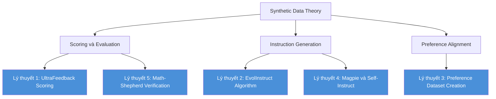

# Lộ trình Theory Deep Dive

Phần **Theory Deep Dive** đi sâu vào nền tảng lý thuyết của các thuật toán và phương pháp luận mà distilabel triển khai. Mục tiêu không chỉ là hiểu cách gọi API, mà là hiểu tại sao các thiết kế đó hoạt động và khi nào chúng thất bại.

## Bản đồ lý thuyết

## Năm chủ đề lý thuyết

### Lý thuyết 1: UltraFeedback Scoring

UltraFeedback là phương pháp đánh giá LLM outputs trên bốn chiều độc lập: Instruction Following, Truthfulness, Honesty và Helpfulness. Mỗi chiều được GPT-4 chấm điểm từ 1 đến 5. Phần lý thuyết này phân tích tại sao đánh giá đa chiều vượt trội hơn so với single scalar score, và cách aggregated score được dùng để xây dựng preference pairs cho DPO training.

### Lý thuyết 2: EvolInstruct Algorithm

EvolInstruct (từ WizardLM) là thuật toán tiến hóa instruction qua hai chiến lược: In-breadth evolution để đa dạng hóa tập instruction, và In-depth evolution để tăng độ phức tạp. In-depth bao gồm năm toán tử đột biến: Add Constraints, Deepen, Concretize, Increase Reasoning và Complicate Input. Phần này mô hình hóa quá trình tiến hóa dưới dạng cây đồ thị có hướng.

### Lý thuyết 3: Preference Dataset Creation

Preference data là nhiên liệu của RLHF và DPO. Phần này so sánh hai nguồn annotation: human labeling (chất lượng cao nhưng chi phí lớn) và LLM-as-judge (có thể mở rộng quy mô). Nền tảng xác suất của pairwise comparison được hình thức hóa qua mô hình Bradley-Terry, từ đó dẫn đến quy trình tạo chosen/rejected pairs.

### Lý thuyết 4: Magpie và Self-Instruct

Self-Instruct dùng seed instructions và LLM để bootstrap tập huấn luyện. Magpie là kỹ thuật mới hơn khai thác pre-query template của chat model để sinh instruction mà không cần seed pool, tạo ra phân phối tự nhiên hơn. Phần này so sánh hai phương pháp trên các trục: đa dạng, tính tự nhiên, khả năng kiểm soát.

### Lý thuyết 5: Math-Shepherd Verification

Math-Shepherd áp dụng process reward model (PRM) cho bài toán toán học. Thay vì chỉ đánh giá đáp án cuối cùng (outcome reward), PRM gán phần thưởng cho từng bước lập luận trung gian. Điều này cho phép phát hiện lỗi suy luận sớm và tạo training signal dày đặc hơn cho chain-of-thought reasoning.

## Mối quan hệ giữa các lý thuyết

| Phương pháp | Đầu vào | Đầu ra | Dùng cho |
|---|---|---|---|
| UltraFeedback | LLM outputs | Preference pairs | DPO / RLHF |
| EvolInstruct | Seed instructions | Diverse instructions | SFT |
| Preference Dataset | Multi-generation | Ranked pairs | DPO |
| Magpie | Chat template | Instructions | SFT / DPO |
| Math-Shepherd | CoT reasoning steps | Step-level rewards | Math SFT |

## Thứ tự học khuyến nghị

| Thứ tự | Chủ đề | Lý do |
|---|---|---|
| 1 | UltraFeedback Scoring | Nền tảng cho preference data |
| 2 | Preference Dataset Creation | Ứng dụng trực tiếp của scoring |
| 3 | EvolInstruct | Sinh instruction phức tạp |
| 4 | Magpie và Self-Instruct | Phương pháp sinh instruction thay thế |
| 5 | Math-Shepherd | Chủ đề nâng cao, yêu cầu hiểu PRM |

Hiểu sâu lý thuyết nền tảng giúp người dùng distilabel không chỉ gọi đúng class mà còn thiết kế pipeline phù hợp với đặc thù dữ liệu và mục tiêu fine-tuning cụ thể.
