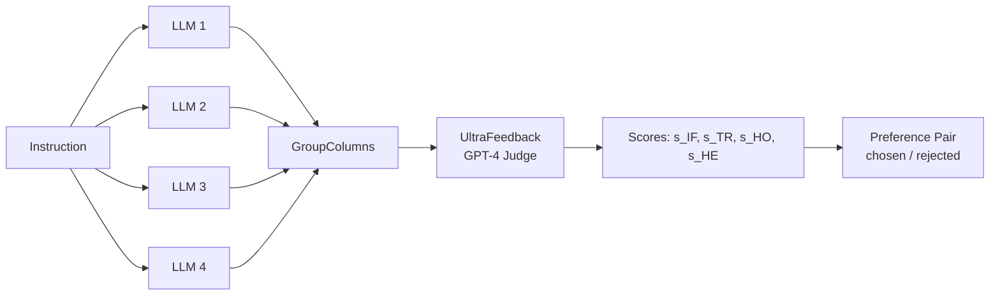

# Lý thuyết 1: UltraFeedback Scoring

## Giới thiệu

UltraFeedback là phương pháp đánh giá LLM outputs do Cui et al. (2023) đề xuất, sử dụng GPT-4 làm **annotator tự động** để chấm điểm các câu trả lời trên nhiều chiều chất lượng. Kết quả là tập dữ liệu preference phục vụ huấn luyện Zephyr, Mistral-Instruct và nhiều mô hình khác.

## Bốn chiều đánh giá

UltraFeedback chấm điểm mỗi LLM output theo bốn tiêu chí độc lập, mỗi tiêu chí trong thang điểm nguyên $s \in \{1, 2, 3, 4, 5\}$:

| Chiều | Ký hiệu | Mô tả |
|-------|---------|-------|
| Instruction Following | $s_{\text{IF}}$ | Mức độ output tuân thủ yêu cầu của instruction |
| Truthfulness | $s_{\text{TR}}$ | Độ chính xác thực tế, tránh hallucination |
| Honesty | $s_{\text{HO}}$ | Mức độ model thừa nhận giới hạn, không tự tin giả tạo |
| Helpfulness | $s_{\text{HE}}$ | Giá trị thực tế mà output mang lại cho người dùng |

## Công thức Aggregated Score

Điểm tổng hợp cho một output $r$ của model $m$ với instruction $x$ được tính theo trung bình cộng:

$$
\bar{s}(r) = \frac{1}{4}\left(s_{\text{IF}} + s_{\text{TR}} + s_{\text{HO}} + s_{\text{HE}}\right)
$$

Trong trường hợp một số chiều không áp dụng được (ví dụ: instruction không yêu cầu kiến thức thực tế), công thức điều chỉnh thành trung bình có trọng số:

$$
\bar{s}(r) = \frac{\sum_{k} w_k \cdot s_k}{\sum_{k} w_k}, \quad w_k \in \{0, 1\}
$$

## Tại sao Multi-Dimension vượt trội

Single scalar score có hai nhược điểm cơ bản. Thứ nhất, **information collapse**: một output truthful nhưng unhelpful và một output helpful nhưng hallucinating có thể nhận cùng scalar score 3, trong khi chúng nên được xử lý khác nhau trong preference training. Thứ hai, **training signal mơ hồ**: mô hình DPO không biết output bị reject vì lý do gì.

Multi-dimension scoring giải quyết vấn đề này bằng cách bảo toàn cấu trúc thông tin:

$$
\text{Info}(\text{multi}) = H(s_{\text{IF}}, s_{\text{TR}}, s_{\text{HO}}, s_{\text{HE}}) \geq H(\bar{s}) = \text{Info}(\text{single})
$$

trong đó $H$ ký hiệu entropy thông tin.

## Tạo Preference Pairs

Với một instruction $x$ và tập $n$ responses $\{r_1, r_2, \ldots, r_n\}$ từ $n$ LLM khác nhau, preference pair được xây dựng như sau:

$$
r_{\text{chosen}} = \arg\max_{r_i} \bar{s}(r_i), \qquad r_{\text{rejected}} = \arg\min_{r_i} \bar{s}(r_i)
$$

Cặp $(x, r_{\text{chosen}}, r_{\text{rejected}})$ sau đó được dùng để tối ưu hóa theo DPO objective:

$$
\mathcal{L}_{\text{DPO}} = -\mathbb{E}\left[\log \sigma\left(\beta \log \frac{\pi_\theta(r_{\text{chosen}} \mid x)}{\pi_{\text{ref}}(r_{\text{chosen}} \mid x)} - \beta \log \frac{\pi_\theta(r_{\text{rejected}} \mid x)}{\pi_{\text{ref}}(r_{\text{rejected}} \mid x)}\right)\right]
$$

## Pipeline trong Distilabel

## Giới hạn của phương pháp

Mặc dù hiệu quả, UltraFeedback phụ thuộc vào **GPT-4 as judge** có hai rủi ro: (1) position bias, GPT-4 có xu hướng ưu tiên response xuất hiện trước trong prompt, và (2) verbosity bias, câu trả lời dài hơn thường được đánh giá cao hơn bất kể chất lượng thực. Distilabel giảm thiểu position bias bằng cách thay đổi thứ tự responses ngẫu nhiên trước khi gửi cho judge.
