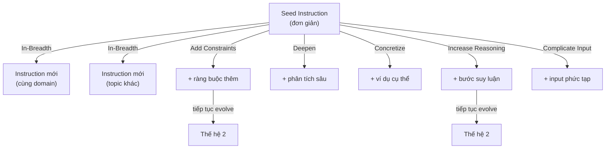

# Lý thuyết 2: EvolInstruct Algorithm

## Nguồn gốc

EvolInstruct được giới thiệu trong bài báo **WizardLM** (Xu et al., 2023) với mục tiêu tự động tăng cường độ phức tạp và đa dạng của instruction datasets. Ý tưởng cốt lõi: thay vì thu thập thủ công, ta dùng LLM để **tiến hóa** các instruction đơn giản thành tập dữ liệu phong phú hơn theo hai hướng.

## Hai loại Evolution

### In-Breadth Evolution (Mở rộng theo chiều rộng)

In-breadth tạo ra **instruction mới** từ instruction gốc, giúp tăng tính đa dạng topic. LLM được yêu cầu sinh một instruction cùng domain nhưng khác biệt về nội dung:

$$
x_{\text{new}} = \text{LLM}(x_{\text{seed}}, \text{prompt}_{\text{breadth}})
$$

Mutation này nhằm tăng coverage của không gian instruction $\mathcal{X}$.

### In-Depth Evolution (Tăng độ phức tạp)

In-depth **biến đổi instruction hiện có** để tăng mức độ khó, yêu cầu khả năng lý luận cao hơn từ model. In-depth có 5 mutation operators:

| Operator | Mô tả | Ví dụ |
|----------|-------|-------|
| **Add Constraints** | Thêm điều kiện ràng buộc | "Giải bài toán mà không dùng vòng lặp" |
| **Deepen** | Yêu cầu phân tích sâu hơn | "Giải thích cơ chế phân tử của quá trình X" |
| **Concretize** | Chuyển khái niệm trừu tượng thành cụ thể | "Đưa ra ví dụ thực tế cho lý thuyết Y" |
| **Increase Reasoning** | Tăng bước suy luận cần thiết | "Chứng minh bằng quy nạp rằng..." |
| **Complicate Input** | Làm phức tạp dữ liệu đầu vào | Thêm nhiễu hoặc điều kiện nhiều tầng |

## Cây Tiến Hóa



## Điều kiện Dừng và Lọc Chất Lượng

EvolInstruct không evolve vô hạn. Một instruction bị loại bỏ nếu thỏa một trong các điều kiện:

1. **Copy condition**: Output chứa cụm "I cannot rewrite" hoặc tương tự, nghĩa là LLM từ chối evolve.
2. **No change condition**: Instruction mới quá giống instruction cũ, $\text{ROUGE-L}(x_{\text{new}}, x_{\text{old}}) > \tau$.
3. **Length condition**: Instruction mới ngắn hơn instruction gốc (evolution thất bại).

## Hàm Phức Tạp và Phân Phối

Sau $T$ vòng tiến hóa, phân phối độ phức tạp của dataset dịch về phía phải:

$$
\mathbb{E}[\text{complexity}(x^{(T)})] > \mathbb{E}[\text{complexity}(x^{(0)})]
$$

Sự dịch chuyển này có thể đo bằng **Instruction Following Difficulty (IFD) score** hoặc perplexity của một reference model trên instruction đó.

## Triển khai trong Distilabel

Distilabel cung cấp `EvolInstruct` step với tham số chính:

```python
from distilabel.steps.tasks import EvolInstruct

evol = EvolInstruct(
    llm=llm,
    num_evolutions=5,          # số vòng tiến hóa
    store_evolutions=True,     # lưu toàn bộ cây tiến hóa
    generate_answers=True,     # sinh cả response cho instruction đã evolve
    mutation_templates="WIZARD_LM",  # dùng template gốc của WizardLM
)
```

Tham số `store_evolutions=True` cho phép phân tích trajectory tiến hóa, rất hữu ích khi nghiên cứu chất lượng từng bước mutation.

## Hạn chế

EvolInstruct có xu hướng tập trung quá nhiều vào **complexity** mà không đảm bảo **diversity về topic**. Giải pháp là kết hợp In-breadth evolution (tăng topic diversity) trước, sau đó mới áp dụng In-depth evolution cho mỗi nhánh topic mới sinh ra.
