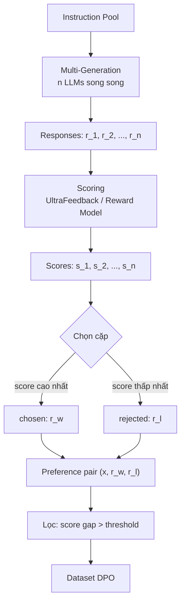

# Lý thuyết 3: Preference Dataset Creation

## Tại sao cần Preference Data

Supervised fine-tuning (SFT) chỉ dạy model bắt chước phân phối dữ liệu huấn luyện. Để model học cách **ưu tiên** output tốt hơn output tệ, ta cần dữ liệu có cấu trúc pairwise: với mỗi instruction $x$, ta cung cấp một response tốt hơn $r_w$ (winner/chosen) và một response kém hơn $r_l$ (loser/rejected). Dạng dữ liệu này là đầu vào của cả RLHF lẫn DPO.

## Hai nguồn Annotation

### Human-annotated

Annotator con người đọc từng cặp response và chỉ ra cặp nào tốt hơn. Ưu điểm: chất lượng cao, bắt được các sắc thái ngôn ngữ tinh tế. Nhược điểm: chi phí lớn, tốc độ chậm, inter-annotator agreement thấp với các task phức tạp (thường $\kappa < 0.7$).

### LLM-as-Judge

Một LLM mạnh (GPT-4, Claude) đóng vai trò judge để so sánh hoặc chấm điểm responses. Chi phí thấp hơn vài bậc độ lớn và có thể scale tuyến tính. Tuy nhiên, LLM-as-judge mắc các bias hệ thống:

- **Position bias**: ưu tiên response xuất hiện trước trong prompt
- **Verbosity bias**: ưu tiên response dài hơn bất kể nội dung
- **Self-enhancement bias**: model ưu tiên output của chính mình

## Mô hình Bradley-Terry

Nền tảng thống kê của pairwise comparison là mô hình **Bradley-Terry** (1952). Mỗi response $r_i$ được gán một tham số sức mạnh $\beta_i > 0$. Xác suất response $r_i$ thắng response $r_j$ trong một phép so sánh:

$$
P(r_i \succ r_j) = \frac{\beta_i}{\beta_i + \beta_j} = \frac{e^{\gamma_i}}{e^{\gamma_i} + e^{\gamma_j}}
$$

với $\gamma_i = \log \beta_i$. Đây chính xác là dạng hàm sigmoid, cho phép tối ưu hóa bằng logistic regression:

$$
\mathcal{L}_{\text{BT}} = -\sum_{(i,j): i \succ j} \log \sigma(\gamma_i - \gamma_j)
$$

DPO objective có thể được dẫn xuất trực tiếp từ Bradley-Terry khi $\gamma_i = \beta \log \frac{\pi_\theta(r_i \mid x)}{\pi_{\text{ref}}(r_i \mid x)}$.

## Pipeline tạo Preference Pairs

## Tiêu chí lọc chất lượng

Không phải mọi cặp chosen/rejected đều có giá trị như nhau. Một cặp chỉ có training signal mạnh khi:

$$
\Delta s = \bar{s}(r_w) - \bar{s}(r_l) \geq \tau
$$

với $\tau$ thường được đặt ở $0.5$ hoặc $1.0$ trên thang 1-5. Cặp có $\Delta s$ nhỏ thường gây noise cho DPO training.

## So sánh phương pháp

| Tiêu chí | Human Annotation | LLM-as-Judge |
|---|---|---|
| Chi phí mỗi cặp | 0.5 - 2 USD | 0.01 - 0.05 USD |
| Tốc độ | Hàng ngày | Hàng giờ |
| Khả năng scale | Thấp | Cao |
| Position bias | Có (thấp) | Có (cao) |
| Chất lượng tuyệt đối | Cao | Trung bình |

Distilabel cung cấp cả hai hướng: tích hợp LLM-as-judge qua `UltraFeedback`, `PrometheusEval` và `JudgeLM`, đồng thời hỗ trợ nhập annotation từ Argilla (human feedback platform) vào cùng pipeline.
