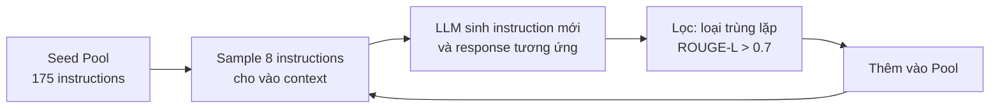
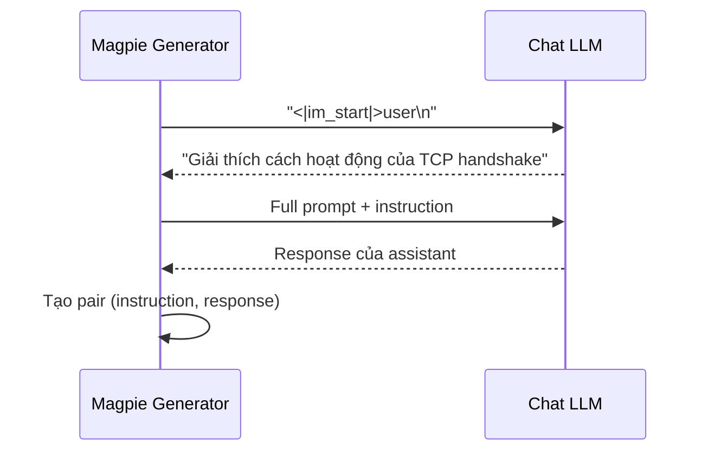

# Lý thuyết 4: Magpie và Self-Instruct

## Bài toán Bootstrap Instruction

Một trong những thách thức cơ bản của synthetic data generation là **cold start**: làm thế nào tạo ra hàng chục nghìn instruction chất lượng cao khi chưa có dữ liệu ban đầu? Hai phương pháp tiêu biểu giải quyết bài toán này theo hướng đối lập nhau là Self-Instruct và Magpie.

## Self-Instruct

Self-Instruct (Wang et al., 2022) là phương pháp bootstrap tập instruction từ một seed pool nhỏ. Quy trình gồm bốn bước lặp:



Công thức similarity dùng để lọc:

$$
\text{sim}(x_{\text{new}}, x_i) = \text{ROUGE-L}(x_{\text{new}}, x_i) = \frac{\text{LCS}(x_{\text{new}}, x_i)}{\max(|x_{\text{new}}|, |x_i|)}
$$

Instruction $x_{\text{new}}$ bị loại bỏ nếu $\max_i \text{sim}(x_{\text{new}}, x_i) > \tau$ với $\tau = 0.7$.

### Hạn chế của Self-Instruct

Self-Instruct bị ảnh hưởng bởi phân phối của seed pool. Nếu seed pool thiên lệch về một số chủ đề, dataset tạo ra sẽ phản ánh sự thiên lệch đó. Ngoài ra, LLM thường sinh instruction với ngữ pháp quá chuẩn mực, không phản ánh cách người dùng thực sự đặt câu hỏi.

## Magpie

Magpie (Xu et al., 2024) tiếp cận bài toán theo hướng hoàn toàn khác: thay vì yêu cầu LLM tạo instruction, ta khai thác **pre-query template** của model để model tự sinh instruction như thể đây là cuộc hội thoại thực.

### Cơ chế hoạt động

Chat model được fine-tuned để hiểu template:

```
<|im_start|>user
{instruction}
<|im_start|>assistant
```

Magpie chỉ cung cấp phần `<|im_start|>user\n` và để model **auto-regressively hoàn thiện** phần instruction. Vì model đã học phân phối của người dùng thực, instruction sinh ra phản ánh tự nhiên hơn những gì người dùng thực sự hỏi.



### Tại sao Magpie tự nhiên hơn

Về mặt lý thuyết, Magpie lấy mẫu từ phân phối $p_\theta(x)$ được model học từ dữ liệu người dùng thực trong quá trình fine-tuning. Trong khi Self-Instruct lấy mẫu từ $p_\theta(x \mid \text{seed examples})$, Magpie lấy mẫu từ marginal distribution của instruction:

$$
x_{\text{Magpie}} \sim p_\theta(x \mid \text{template prefix})
$$

## So sánh hai phương pháp

| Tiêu chí | Self-Instruct | Magpie |
|---|---|---|
| Cần seed data | Có (175+ instructions) | Không |
| Kiểm soát topic | Cao (qua seed) | Thấp |
| Tính tự nhiên | Trung bình | Cao |
| Đa dạng | Phụ thuộc seed | Cao, phản ánh training data |
| Yêu cầu model | Bất kỳ LLM | Phải là chat model có template |
| Nguy cơ bias | Seed pool bias | Training data bias |

## Triển khai trong Distilabel

```python
from distilabel.steps.tasks import MagpieGenerator

magpie = MagpieGenerator(
    llm=llm,
    n_turns=1,                  # single-turn conversation
    num_rows=5000,
    system_prompt="You are a helpful assistant.",
    only_instruction=False,     # sinh cả instruction lẫn response
)
```

Tham số `only_instruction=True` hữu ích khi muốn chỉ lấy instruction rồi dùng model khác để sinh response, tạo pipeline đánh giá đa LLM.
